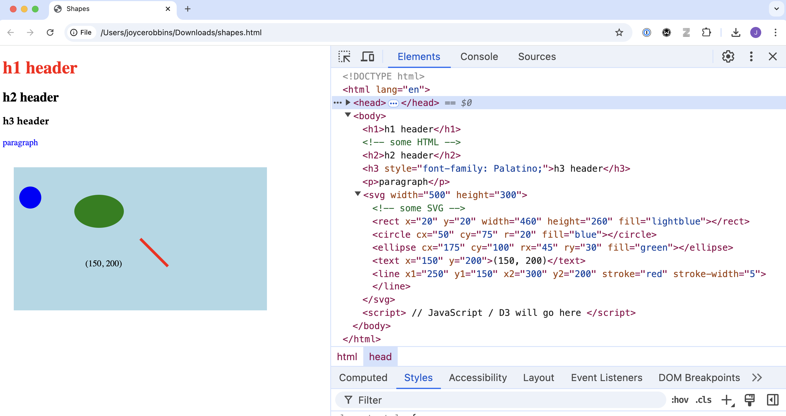

--- 
title: "D3 for R Users"
author: "Joyce Robbins"
date: "`r Sys.Date()`"
site: bookdown::bookdown_site
always_allow_html: yes
---
```{r include=FALSE, cache=FALSE}
makesvg <- function(name = "svg", width = 300, height = 200) {
  if (name == "svg") {
    selector <- "svg"
  } else {
    selector <- paste0("svg#", name)
  }

  cat(paste0("<svg id='", name, "' width='", width,"' height='", height, "'>\n"))
  cat(paste0("<rect x='0' y='0' width='", width, "' height ='",  height, "' fill = 'lightblue'></rect>\n"))
  cat(paste0("<text x='10' y='", height - 10, "' style = 'font-size: 80%;'>", selector, "</text>\n"))
  cat("</svg>")
}

knitr::opts_chunk$set(
  out.width='100%',
  echo = TRUE,
  comment="## R output ## ",
  message=FALSE,
  warning=FALSE
)

HTML <- knitr::is_html_output()
```

# Welcome to D3 {-}

```{r include=FALSE}
# automatically create a bib database for R packages
#knitr::write_bib(c(
#  .packages(), 'bookdown', 'knitr', 'rmarkdown'
#), 'packages.bib')

htmltools::tagList(rmarkdown::html_dependency_font_awesome())
klippy::klippy(c("js", "r"))
```

<style>
rect {
	pointer-events: all;
	}

	.node {
	fill: blue;
	}

	.cursor {
	fill: none;
	stroke: brown;
	pointer-events: none;
	}

	.link {
	stroke: red;
}

.svg-container {
	display: inline-block;
	position: relative;
	width: 100%;
	padding-bottom: 20%;  <!-- changed this to be the same as y/x aspect ratio, not explained-->
	vertical-align: top;
	overflow: hidden;
}
.svg-content {
	display: inline-block;
	position: absolute;
	top: 0;
	left: 0;
}
</style>

<div id="container" class="svg-container">
<script src="https://d3js.org/d3.v3.min.js"></script>
<script src="scripts/index1.js"></script>
</div>


```{r, eval=!HTML, echo=FALSE}
knitr::include_graphics("images/pdfbook/buildyourowngraph.png")
```

```{asis, echo=HTML}
<div style="text-align: right; font-size: 85%; font-style: italic;"> <!-- text-align needs to be in parent -->
Adapted from <a href="https://bl.ocks.org/mbostock/929623" target="_blank">Build Your Own Graph!</a>
</div>
```


This guide serves as a companion text to Scott Murray’s [*Interactive Data Visualization for the Web, 2nd edition*](https://www.amazon.com/Interactive-Data-Visualization-Web-Introduction/dp/1491921285/)--henceforth *IDVW2*--a required text for GR5702. Be sure to get the second edition, which is a comprehensive update to D3 version 4. The first edition uses D3 version 3, which is not compatible. (The current version of D3 is actually v7.  However, since differences between v4 and v5/v6/v7 are minimal, unless otherwise indicated in this guide, the code in *IDVW2* will work with either.)

We rely on the text heavily but also deviate from it in several ways. *IDVW2* is written for graphics designers not data science students so the pain points are somewhat different. 

D3 is a JavaScript library, not a standalone language, so any time we refer to D3 we really mean D3/JavaScript, though it is not necessary to know JavaScript well before beginning; we will learn as we go. Most of the JavaScript we use is covered in *IDVW2*, though we also use some newer JavaScript options from ES5 and ES6, such as `.map()`, `.filter()`, arrow functions and template literals, that make coding easier (and more like R!)^[Ok, they're not actually that new, but it takes a while for new JavaScript to catch on, mainly due to concern with maintaining compatibility with older browsers. Since D3 itself is not compatible with very old browsers, and since we can't focus on everything at once, we are not going to concern ourselves with browser compatibility. If you are interested in this, [caniuse.com](https://caniuse.com){target="_blank"} is very helpful for looking up what works where.] We use different examples, though you are strongly encouraged to study [Murray's code examples ](https://github.com/alignedleft/d3-book/releases){target="_blank"} in addition to reading the text. Particularly through the first half, we don't follow the text in order, so always refer to this guide first which will direct you to the pages of the text that you should read.

This is very much a work-in-progress so please [submit issues](https://github.com/jtr13/d3book/issues){target="_blank"} on GitHub to provide feedback and edit or add text by submitting pull requests. (Click the <i class="fas fa-edit"></i> icon at the top of each page to get started. More [detailed instructions](https://edav.info/contribute.html#step-2-click-the-edit-button){target="_blank"} are available on edav.info. If you would just like to view the source code, click the <i class="fa fa-eye"></i> icon.)

## Workflow

A big hurdle to learning a new language is just getting setup. Often authors forget to mention what your programming environment should look like, what should be open on the screen. I will try not to do that and be as clear as possible so you know where you should be entering the code in the pages that follow. This task is somewhat complicated by the fact that we will be using a variety of workflow options.  This section will serve as a reference guide; future sections will link back here as appropriate.

All of our workflows require Google Chrome, so if you don't have it already, [download and install it](https://www.google.com/chrome/){target="_blank"}.


### JavaScript Console

With this workflow we will open a web page--either online or local--in Chrome and [run JavaScript in the Console](https://developers.google.com/web/tools/chrome-devtools/console/javascript){target="_blank"}. To view the Console, open Chrome DevTools by clicking *View, Developer, JavaScript Console* if you have a menu bar in Chrome, using a keyboard shortcut (Mac: option+command+j; Windows, Linux, Chrome OS: control+shift+J), or employing another one of the [many options](https://developers.google.com/web/tools/chrome-devtools/open){target="_blank"} for doing so. The Console is one piece of a suite of tools available in the browser.

With the DevTools open, your screen will look like this:

```{r, echo=FALSE}
knitr::include_graphics("images/console.png")
```


The next chapter, [Jump in the deep end](jump.html), employs this workflow.

### This book in the Console

If you're not reading the `.pdf` version, you can open DevTools on this very page. This is very convenient because not only to you not have to leave this book to practice D3, you can copy code blocks and paste them in the Console.  In addition to opening DevTools (see above), close the side bar by clicking on the <i class="fa fa-align-justify"></i> icon above to give yourself more screen space.

Let's try it out. 

> <i class="fa fa-hand-o-right"></i> *Open the JavaScript Console* <i class="fa fa-terminal"></i>

```{r, echo=FALSE, results='asis', eval=HTML}
makesvg("demo")
```

```{r, echo=FALSE, eval=!HTML, out.width='33%'}
knitr::include_graphics("images/pdfbook/svg1.png")
```


Scroll so that both the blue rectangle above and the code chunk below are visible on your screen. Toggle the sidebar, open the Console, and then move the mouse onto the code block so the <i class="fa fa-copy"></i> icon appears. Click on it to copy the code, paste it in the Console, and then press return.

``` js
d3.select("svg#demo")
  .append("circle")
    .attr("cx", "-25")              
    .attr("cy", "100")
    .attr("r", "20")
    .attr("fill", "red")
  .transition()
  .duration(3000)
    .attr("cx", "325")
  .remove();
```    

Pretty neat.

### Text editor

This is a very basic local setup in which the same `.html` is open both in a text editor (if you don't want to stray too far from home, use RStudio) and in a web browser (we will use Chrome), each on one half of your screen. The workflow is: make changes to the file in the text editor, save the changes and then refresh the page in the browser to see the updates. Keyboard shortcuts for saving and refreshing (on the Mac, command-s and command-r respectively) are very helpful.  

Let's try an example:

Download a copy of `shapes.html` by opening [this page](https://raw.githubusercontent.com/jtr13/d3book/master/code/shapes.html){target="_blank"} and clicking *File, Save Page As...* Open the file in a text editor of your choice on one half of your screen. On the other half of your screen open the same file in Chrome. As you make changes to the `.html` file, save the file and then refresh the browser to see the effects. 

Your screen should look like this:

```{r, out.width='80%', fig.align='center', echo=FALSE}
knitr::include_graphics("images/editor_chrome.png")
```


<!--chapter:end:index.Rmd-->

```{r include=FALSE, cache=FALSE}
makesvg <- function(name = "svg", width = 300, height = 200) {
  if (name == "svg") {
    selector <- "svg"
  } else {
    selector <- paste0("svg#", name)
  }

  cat(paste0("<svg id='", name, "' width='", width,"' height='", height, "'>\n"))
  cat(paste0("<rect x='0' y='0' width='", width, "' height ='",  height, "' fill = 'lightblue'></rect>\n"))
  cat(paste0("<text x='10' y='", height - 10, "' style = 'font-size: 80%;'>", selector, "</text>\n"))
  cat("</svg>")
}

knitr::opts_chunk$set(
  out.width='100%',
  echo = TRUE,
  comment="## R output ## ",
  message=FALSE,
  warning=FALSE
)

HTML <- knitr::is_html_output()
```
# Jump in the deep end <i class="fas fa-swimmer"></i> {#jump} 


Let's skip the explanations and start coding in D3 right now. Why? So you can see the benefits and know what you're working toward when you get stuck in the weeds.  Then we'll go back and start learning step by step. In this chapter we will work in the JavaScript Console ([help](index.html#javascript-console)).


## Get ready <i class="fas fa-forward"></i>

1. If you don't have it, [install the Chrome browser](https://www.google.com/chrome/){target="_blank"}.

2. Download a copy of `shapes.html` by opening the following page and then saving with *File, Save Page As...*: [`shapes.html`](https://raw.githubusercontent.com/jtr13/d3book/master/code/shapes.html){target="_blank"}. (Or download a zip of the whole repo. Clicking [here](https://github.com/jtr13/d3book/archive/master.zip){target="_blank"} will start the download. Or fork and clone the  [repo](https://github.com/jtr13/d3book){target="_blank"}).

3. If Chrome is your default browser, open `shapes.html` by double clicking it. Otherwise, open it with *File, Open File...* in Chrome.

## Elements tab <i class="far fa-folder"></i>

1. Open Chrome DevTools ([help](index.html#javascript-console)).

2. Hover the mouse over various elements in the `<body> ... </body>` section.  Observe the highlighted sections in the rendered web page on the left of the screen. Click on the mini black triangles to the left of the `<body>` and `<svg>` tags if needed to open these sections of the DOM tree. Your screen should look like this:

```{r, echo=FALSE, fig.align='center', out.width="80%"}

```

3. Now try the reverse: right click on elements on the web page, choose "Inspect" and see what is highlighted in the Elements pane. Get comfortable with the connection between the code on the right and the rendered elements on the left.

## Console tab <i class="far fa-folder"></i>

1. Switch to the Console tab, next to the Elements tab. Let's practice running some code. Note that the code is unrelated to the `shapes.html` web page that we have open. 
    
> <i class="far fa-lightbulb"></i> *We will spend a lot of time in the Console since it's interactive -- think R console. Eventually we will switch to including JavaScript/D3 in `.html` or `.js` files and use the Console only for testing things out or debugging.* 


2. Type the following lines of code at the prompt (`>`), press enter after each line--that is, after the semicolon (`;`)--and see what happens:

``` javascript
3 + 4;
    
"3" + "4";

 x = [1, 2, 3];
    
x[1];
    
x + 1;
    
y = {a: 3, b: 4};
    
y["b"];
```

## Modify elements <i class="fas fa-exchange-alt"></i>

1.  Now we'll start using D3 to manipulate elements on the page. Try the following, by entering one line at a time in the Console as before:

    ``` javascript
    d3.select("circle").attr("cx", "200");

    d3.select("circle").attr("cx", "500");

    d3.select("circle").attr("cx", "100");

    d3.select("circle").attr("r", "30");

    d3.select("circle").attr("r", "130");

    d3.select("circle").attr("r", "3");

    d3.select("circle").attr("fill", "red");

    d3.select("circle").attr("fill", "aliceblue");

    d3.select("circle").attr("fill", "lightseagreen");
    ```
    
    
> <i class="far fa-lightbulb"></i> *Note that "select" and "attr" are separate operations chained together with "." -- think pipe (%>%) operator.*

    

2.  Refresh the page. What happened?

3.  Go to Elements. Look at the value of the `y1` attribute of the SVG `<line>` element. Go back to the Console and enter the following:

    ``` javascript
    d3.select("line").attr("y1", "10");
    ```

4.  Switch back to Elements and observe. What happened?

5.  Stay in Elements and refresh the page. What happened to `y1`?

6. Return to the Console to make style changes to the HTML elements:

    ``` javascript
    d3.select("h1").style("color", "purple");

    d3.select("h2").style("font-size", "50px");

    d3.select("h2").style("font-family", "Impact");
    ```

## Add transitions <i class="far fa-paper-plane"></i>

1.  Try these:

    ``` javascript
    d3.select("circle").transition().duration(2000).attr("cx", "400");

    d3.select("ellipse").transition().duration(2000).attr("transform", "translate (400, 400)");

    d3.select("line").transition().duration(2000).attr("x1", "400");

    d3.select("line").transition().duration(2000).attr("y1", "250");

    d3.select("p").transition().duration(2000).style("font-size", "72px");
    ```

2.  Experiment with more transitions.

## Add interactivity <i class="fas fa-mouse-pointer"></i> 


1.  Set up a function to turn the fill color to yellow:

    ``` javascript
    function goyellow() {d3.select(this).attr("fill", "yellow")};
    ```

2.  Add an event listener to the circle that will be trigger a call to `goyellow()` on a mouseover:

    ``` javascript
    d3.select("circle").on("mouseover", goyellow);
    ```

3.  Test it out.

4.  Add the same event listener to the ellipse. Test it out.

5.  Create a function `goblue()` that changes the fill color to blue.

6.  Add event listeners to the circle and ellipse that will trigger a call to `goblue()` on a *mouseout*. Test out your code.

7.  Try out a click event. (Note the use of an anonymous function.)

    ``` javascript
    d3.select("line").on("click", function()
      {d3.select(this).attr("stroke-width", "10");});
    ```

8.  Try another click event. What's happening?

    ``` javascript
    d3.select("svg").on("click", function(event)
      {d3.select("text").text(`(${d3.pointer(event)})`)});
    ```

<!--chapter:end:jump.Rmd-->

```{r include=FALSE, cache=FALSE}
makesvg <- function(name = "svg", width = 300, height = 200) {
  if (name == "svg") {
    selector <- "svg"
  } else {
    selector <- paste0("svg#", name)
  }

  cat(paste0("<svg id='", name, "' width='", width,"' height='", height, "'>\n"))
  cat(paste0("<rect x='0' y='0' width='", width, "' height ='",  height, "' fill = 'lightblue'></rect>\n"))
  cat(paste0("<text x='10' y='", height - 10, "' style = 'font-size: 80%;'>", selector, "</text>\n"))
  cat("</svg>")
}

knitr::opts_chunk$set(
  out.width='100%',
  echo = TRUE,
  comment="## R output ## ",
  message=FALSE,
  warning=FALSE
)

HTML <- knitr::is_html_output()
```
# Web tech <i class="fas fa-server"></i> {#web}

Read *IDVW2*, Chapter 3: Technology Fundamentals

*There is a lot of material in this chapter. It is worth making the effort to learn it now and start D3 with a solid foundation of elementary HTML/CSS/SVG/JavaScript.*

Here we examine `shapes.html` from Chapter 1 to see how the various technologies are combined into a single document.

## HTML <i class="fab fa-html5"></i>

Note that `shapes.html` has an HyperText Markup Language or `.html` extension; HTML in fact provides the structure for the document.  It has a `<head>` and `<body>` section. 

In the `<head>` section we use `<script>` tags to link to the D3 library:

``` js
<script src="https://d3js.org/d3.v7.js"></script>
```

HTML content is enclosed between opening an closing **tags** such as `<h1>` and `</h1>`.

HTML class and ID **attributes** are included inside the opening tags:

`<h1 class="myclass" id="myid">This is an h1 header.</h1>`


## CSS <i class="fab fa-css3"></i>

CSS (Cascading Style Sheets) is used for styling web pages, and more importantly for our purposes, selecting elements on a page or in a graphic. We will generally work with internal style sheets since it's simpler when starting out to have everything in one document.  External style sheets, however, are generally the preferred method for web design.

### Internal style sheet

`shapes.html` has an *internal style sheet*: CSS style information appears in the `<head>` section marked off with `<style>` tags:

``` js
<style type="text/css">
    h1 {color:red;}		/* CSS styling */
    p {color:blue;}
</style>
```

Here we specify that all HTML `<h1>` headers should be red and all HTML paragraphs `<p>` should be blue.  This is an example of an *internal style sheet*. Later we will consider alternatives: *external style sheets* and *inline styling*. 

Styling for coder designed classes is also specified in this section.  For example, we could style a "formal" class as such:

``` js
<style type="text/css">
    .formal {color: red;        
        font-size: 30px;
        font-family: Lucida Calligraphy;
        }   
</style>
```

Note that classes are defined by the "." before the name.


### External style sheets

External style sheets are `.css` files that contain styling information and are linked to with a `<link>` tag in the `<head>` section of an HTML document:

``` js
<head>
    <link rel="stylesheet" href="style.css">
</head>
```

External style sheets are the preferred way of styling as they can easily be modified without changing the web page; in fact, the motivation for CSS came from a desire in the early days of the internet to separate styling from content.


Developers have the option now of choosing premade themes, which are shared through external style sheets. They can be quite complex. The [`.css` file](https://github.com/thomaspark/bootswatch/blob/master/docs/4/minty/bootstrap.css){target="_blank"} for the <a href="https://bootswatch.com/minty/" target="_blank" style = "font-family: Roboto; background-color: #78C2AD; color: white; border-radius: 5px">&nbsp;Minty&nbsp;</a> theme from Bootswatch, for example, contains over 10,000 lines.

[CSS Zen Garden](http://www.csszengarden.com/){target="_blank"} demonstrates the power of external style sheets: the same HTML document takes on very different looks depending on the stylesheet to which it is linked.


### Inline styling

With inline styling, styling is added to each tag individually:

```
<span style="color: white; background-color: fuchsia; font-family: impact; 
      font-size: 24px; border-style: solid; border-color: limegreen; 
      border-width: 3px">
      Styled inline
</span>
```

```{asis, eval=knitr::is_html_output()}
<span style="color: white; background-color: fuchsia; font-family: impact; font-size: 24px; border-style: solid; border-color: limegreen; border-width: 3px">Styled inline</span>
```


This is how early web pages were styled. To take a step back in time, use developer tools to view the source code for the main page of [www.dolekemp96.org](http://www.dolekemp96.org/main.htm){target="_blank"}, an old web site that has been maintained for historical purposes. As you can see, it's a tedious way of writing content, which internal and external style sheets eliminate.

Although you will not be adding inline styling manually, you will notice that when we select elements and change the styling with D3, the modifications are made inline.  In other words, we do not make changes to the elements directly, not via a style sheet.


## SVG <i class="far fa-image"></i>

SVG (Scalable Vector Graphics) is a human readable graphics format that facilitates manipulation of individual elements. You may be familiar with `.svg` files.  Here we have SVG graphics within `<svg>` tags in the `<body>` section of the HTML document:


``` js
<svg width="500" height="300">  <!-- some SVG -->
    <rect x="20" y="20" width="460" height="260" fill="lightblue"></rect>
    <circle cx="50" cy="75" r="20" fill="blue"></circle>
    <ellipse cx="175" cy="100" rx="45" ry="30" fill="green"></ellipse>
    <text x="150" y="200">(150, 200)</text>
    <line x1="250" y1="150" x2="300" y2="200" stroke="red" stroke-width="5"></line>
</svg>
```

Rendered:
<script src="https://d3js.org/d3.v5.min.js"></script>`

```{r, eval=knitr::is_latex_output(), out.width="50%", echo=FALSE}
knitr::include_graphics("images/shapessvg.png")
```

```{asis, eval=knitr::is_html_output()}
<svg width="500" height="300">  <!-- some SVG -->
<rect x="20" y="20" width="460" height="260" fill="lightblue"></rect>
<circle cx="50" cy="75" r="20" fill="blue"></circle>
<ellipse cx="175" cy="100" rx="45" ry="30" fill="green"></ellipse>
<text x="150" y="200">(150, 200)</text>
<line x1="250" y1="150" x2="300" y2="200" stroke="red" stroke-width="5"></line>
</svg>
```

There are very few SVG tags that you'll need to know, and once we get going with D3, you will not have to code any SVG manually. It is worth doing a little to become familiar with the format and in particular to get used to the new location of the origin.

## JavaScript <i class="fab fa-js-square"></i>

JavaScript is the most common language for making web pages interactive. Code is executed when pages are opened or refreshed. So far we have run JavaScript in the Console, but have not included it in the web page itself. When we do so, it will be between `<script>` tags in the `<body>` section of the HTML document, or in a separate `.js` file.

We will learn JavaScript on an as-needed basis. In terms of data, we will begin with simple arrays:

`var x = [3, 5, 1, 6, 7]`

In the [Just Enough JS](just-enough-js.html) chapter, we cover more complex data structures and some methods for data manipulation. 

[javascript.info](https://javascript.info){target="_blank"} is an excellent resource for expanding your knowledge beyond the basics.

## D3 <i class="far fa-chart-bar"></i>

D3 (Data Driven Documents) is a JavaScript library well suited to interactive graphics. As such, it is also included between `<script>` tags in the `<body>` section. For D3 to work, you must link to the D3 library in the `<head>` section of the document.

There seems to be a misconception that D3 is a high level language.  It is not. You will be working on the pixel level to create graphics, including drawing your own axes and doing other things that you're not used to doing if you've been working in R or Python.

> <i class="far fa-lightbulb"></i> *On the bright side, after D3, you will gain a new appreciation for base R graphics. You will write code such as `plot(iris$Sepal.Length, iris$Sepal.Width, pch = 16, col = iris$Species, las = 1, xlab = "Sepal.Length", ylab = "Sepal.Width")` and think: wow, there are axes! Amazing!*

It is legitimate to ask why you need to know D3 as a data scientist. Many if not most of you will not be coding in JavaScript from the ground up in your future careers. However, it's a great way to learn how interactive graphics work under the hood, and will give you a solid foundation which you can draw on to tweak visualizations that you build with high level tools such as [Plotly](https://plot.ly/). 

## HTML tree <i class="fas fa-tree"></i>

While `shapes.html` appears as a single consistent document, it is actually comprised of multiple languages. HTML, CSS, and SVG are already there, and we will be adding JavaScript / D3 soon. 

```{r, echo=FALSE, fig.align='center', out.width='100%'}
knitr::include_graphics("images/shapes.png")
```

Of note:

- An HTML document is composed of lines or sections set off with tags. In particular `<style> ... </style>`, `<svg> ... </svg>`, and `<script> ... </script>` indicate the inclusion of CSS, SVG, and JavaScript/D3 respectively.

- For D3 to work, you must link to a D3 library. To link to the online version, copy and paste the `<script>` line from [https://d3js.org ](https://d3js.org ){target="_blank"}. Alternatively, you can also download a copy from the same site and reference your local copy with:

    ``` js
    <script src="d3.js"></script>
    ```
    
- There are two main sections. The `<head>` section contains the *title*, *link to D3 library*, and *internal CSS*. The `<body>` section contains HTML elements (`<h1>`, `<p>`, etc.), SVGs (between `<svg>`/`</svg>`tags) and JavaScript/D3 scripts (between `<script>`/`<script>`tags).

> <i class="far fa-lightbulb"></i> *Do not assume that if it works that it is correct; today's browsers can be very forgiving.*

- Comment syntax varies with language:

    - `<!-- single or multiline HTML or SVG comment -->`
    
    - `/* single or multiline CSS comment */`
    
    - `// single line JavaScript comment`
    
    - `/* JavaScript` <br> `multiline comment */`
    
## Exercise <i class="fas fa-dumbbell"></i>: shapes

Download a copy of `shapes.html` by opening [this page](https://raw.githubusercontent.com/jtr13/d3book/master/code/shapes.html){target="_blank"} and clicking *File, Save Page As...* Set yourself up to work locally in a text editor [help](index.html#text-editor). (Developer Tools should not be open; we will not be using the Console.)

1. Add an additional circle to the svg.

2. Add styling to the internal style sheet to style circles.

3. Add two additional paragraphs using the `<p>` tag.

4. Add an ID attribute to one of the circles.

5. Add a class attribute to two of the `<p>` tags.

6. Use the internal style sheet to style paragraphs of the class you created in 5.

7. Adjust additional elements as desired.

[Solution](solutions/webtech_shapes.html){target="_blank"}
*Contributed by Tracy Liu*

<!--chapter:end:web.Rmd-->

```{r include=FALSE, cache=FALSE}
makesvg <- function(name = "svg", width = 300, height = 200) {
  if (name == "svg") {
    selector <- "svg"
  } else {
    selector <- paste0("svg#", name)
  }

  cat(paste0("<svg id='", name, "' width='", width,"' height='", height, "'>\n"))
  cat(paste0("<rect x='0' y='0' width='", width, "' height ='",  height, "' fill = 'lightblue'></rect>\n"))
  cat(paste0("<text x='10' y='", height - 10, "' style = 'font-size: 80%;'>", selector, "</text>\n"))
  cat("</svg>")
}

knitr::opts_chunk$set(
  out.width='100%',
  echo = TRUE,
  comment="## R output ## ",
  message=FALSE,
  warning=FALSE
)

HTML <- knitr::is_html_output()
```
# D3 in the Console <i class="far fa-folder"></i> {#d3console}

Read *IDVW2*, Chapter 6: Drawing with Data. Skip pp. 89-96 as we will not be drawing bar charts with the `div`approach.

<script src="https://d3js.org/d3.v7.js"></script>

## Selections <i class="fas fa-clipboard-list"></i>

### Select by tag

The ability to select elements on a page is key to being able to manipulate them.  `d3.select()` will select the first match; `d3.selectAll()` will select all matches.

``` js
d3.select("svg").select("circle");
```

selects the first circle in the order in which circles appear in the `<svg>` grouping. If there were more than one circle we could select them all with:

``` js
d3.select("svg").selectAll("circle");
```

We can select HTML elements by tag in the same way:

``` js
d3.select("body").select("h1");
d3.select("body").selectAll("h1");
```

### Select by class

Classes are selected by adding a "." before the class name:

``` js
d3.select("svg").selectAll("circle.apple")
```

This provides one method of selecting a certain collection of elements of the same type.

### Select by ID

IDs differ from classes in that they are unique identifiers.  IDs are selected by adding a "#" before the ID:

``` js
d3.select("svg").select("circle#henry");
```

### Store selections


It is often helpful to store selections for later use. Here we store the svg selection in `mysvg`:

``` js
var mysvg = d3.select("svg");
```

> <i class="far fa-lightbulb"></i> *The JavaScript community is moving toward using `let` and `const` instead of `var`; we, however, will stick with `var` to be consistent with *IDVW2*. Of course you're welcome to use `const` and `let` instead, and if so, may find these articles helpful: [Let It Be - How to declare JavaScript variables](https://madhatted.com/2016/1/25/let-it-be){target="_blank"} and [ES2015 const is not about immutability](https://mathiasbynens.be/notes/es6-const){target="_blank"}.*


Store circle selection in a variable:

``` js
var svg = d3.select("svg");

var circ = svg.selectAll("circle");

```

## Modify existing elements <i class="fas fa-exchange-alt"></i>

Try out the code in this section with a downloaded copy of [five_green_circles.html](https://raw.githubusercontent.com/jtr13/d3book/master/code/five_green_circles.html){target="_blank"} opened in Chrome and the Console visible.

### Modify attributes

[link to get or set attribute API](https://github.com/d3/d3-selection/blob/v1.4.0/README.md#selection_attr)


``` js
d3.select("circle").attr("r");           // see radius

d3.select("circle").attr("r", "10");     // set radius to 10
```

### Modify styles

[link to get or set style API](https://github.com/d3/d3-selection/blob/v1.4.0/README.md#selection_style)


``` js
d3.select("h1").style("color");

d3.select("h1").style("color", "blue");
```

> <i class="far fa-lightbulb"></i> *It is often difficult to remember whether to use `.attr()` or `.style()` In general, properties such as position on the SVG, class, and ID are *attributes*, while decorative properties such as color, font, font size, etc. are *styles*.  However, in some cases, you can use either. For example, the following both make the circle blue:*

``` js
d3.select("circle").attr("fill", "blue");

d3.select("circle").style("fill", "blue");
```
    
*The first will add a `fill="blue"` attribute to the `<circle>` tag, while the latter will add `style="fill: blue;"`. All is well and good until you find yourself with both in the same tag, in which case the `style` property will take precedence. The bottom line: don't mix the two options because it can cause problems.*


> <i class="far fa-lightbulb"></i> *To further complicate matters, `.style()` is just shorthand for `.attr("style", "...")` so the following are in fact equivalent:*

``` js
d3.select("circle").style("fill", "blue");

d3.select("circle").attr("style", "fill: blue;");
```

*In other words, style is an attribute!* <i class="far fa-grimace"></i>


### Modify text

This section is interactive. Hover over code as directed to observe effects.

#### HTML text {-}

<style>
.fancy {
  color: red;
  font-family: garamond;
  font-size: 30px;
}
</style>

``` html
<p id="typo" class="fancy">Manhatten</p>
```

<div>
<p id="typo" class="fancy">Manhatten</p>
</div>

Hover to execute this code (and fix the typo):  

<div id="fixtypo">
```{js, eval=FALSE}
d3.select("#typo").text("Manhattan");
```
</div>

<script>
d3.select("#fixtypo")
.on("mouseover", function () {
d3.select("#typo").text("Manhattan")
})
.on("mouseout", function () {
d3.select("#typo").text("Manhatten")
});
</script>

#### SVG text {-}
``` svg
<svg width="500" height="100">
  <rect width="500" height="100" fill="#326EA4"></rect>
  <text id="svgtypo" x="50" y="70" fill="white" font-weight="bold" font-size="40px">
     Web scrapping is fun.</text>
</svg>  
```

Hover on this SVG to execute the code below it (and fix the typo):  

<svg width="500" height="100">
<rect width="500" height="100" fill="#326EA4"></rect>
<text id="svgtypo" x="50" y="70" fill="white"
    font-weight="bold" font-size="40px">
    Web scrapping is fun.</text>
</svg>  


<div id="fixsvgtypo">
```{js, eval=FALSE}
d3.select("#svgtypo").text("Web scraping is fun.");
```
</div>

<script>
d3.select("#fixsvgtypo")
.on("mouseover", function () {
d3.select("#svgtypo").text("Web scraping is fun.")
})
.on("mouseout", function () {
d3.select("#svgtypo").text("Web scrapping is fun.")
});
</script>  

> <i class="far fa-lightbulb"></i> *The SVG `<text>` tag can be tricky.  It differs from HTML text tags (`<p>, <h1>, <h2>,` etc.) in that it has `x` and `y` attributes that allow you to position text on an SVG canvas. Unlike HTML, the fill attribute controls the color of the text. Compare:*


``` js
d3.select("p").style("color", "red");   // HTML

d3.select("text").attr("fill", "red");  // SVG
```

### Move SVG text

``` svg
<svg width="600" height="100">
  <rect width="600" height="100" fill="#326EA4"></rect>
  <text id="moveleft" x="200" y="70" fill="white" font-weight="bold" font-size="40px">
      I want to move left.</text>
</svg>  
```

Hover on this SVG to execute the code below it:  

<svg width="600" height="100">
<rect width="600" height="100" fill= "#326EA4"></rect>
<text id="moveleft" x="200" y="70" fill="white"
font-weight="bold" font-size="40px">I want to move left.</text>
</svg>  


<div id="move">
```{js, eval=FALSE}
d3.select("#moveleft").attr("x", "20").text("Thanks, now I'm happy!");
```
</div>

<script>
d3.select("#move")
.on("mouseover", function () {
d3.select("#moveleft").attr("x", "20").text("Thanks, now I'm happy!")
})
.on("mouseout", function () {
d3.select("#moveleft").attr("x", "200").text("I want to move left.")
});
</script>

## Add elements <i class="far fa-plus-square"></i>

### HTML

Continue trying out code with `five_green_circles.html` open in Chrome.

The following adds a `<p>` tag but doesn't change how the page looks, since there's no text associated with it.

``` js
d3.select("body").append("p");
```

To add text, use `.text()`:

``` js
d3.select("body").append("p").text("This is a complete sentence.");
```

> <i class="far fa-lightbulb"></i> *To debug adding an element, go to the Elements tab to see what was added and where. If an element is in the wrong place in the HTML tree, it will not be visible.*


### SVG

Likewise, here we add a `<circle>` to the `<svg>`, but we can't see it since it has no attributes.

``` js
d3.select("svg").append("circle");
```

Adding attributes will create visible circles:

``` js
d3.select("svg").append("rect").attr("x", "0").attr("y", "0")
    .attr("width", "500").attr("height", "400").attr("fill", "lightblue");
    
d3.select("svg").append("circle").attr("cx", "200")
    .attr("cy", "100").attr("r", "25").attr("fill", "orange");
    
d3.select("svg").append("circle").attr("cx", "300")
    .attr("cy", "150").attr("r", "25").attr("fill", "red");  
```


We can use a saved selection to assist in creating a new element:

(*IDVW2*, pp. 97-98)

``` js
mysvg = d3.select("svg");

mysvg.append("circle").attr("cx", "250").attr("cy", "250").attr("r", "50")
  .attr("fill", "red");
```

## Remove elements <i class="far fa-minus-square"></i>

These methods will remove matching elements in order, starting with the first find in the document.

### HTML

``` js
d3.select("p").remove();
```

### SVG

``` js
d3.select("svg").select("circle").remove();

d3.select("svg").selectAll("circle").remove();
```


## Exercise <i class="fas fa-dumbbell"></i>: green circles

Download and open a fresh copy of [five_green_circles.html](https://raw.githubusercontent.com/jtr13/d3book/master/code/five_green_circles.html){target="_blank"} in Chrome. Open Developer Tools open and do the following in the Console with D3:

1. Select the circle with ID "henry" and make it blue.

2. Select all circles of "apple" class make them red.

3. Select the first circle and add an orange border ("stroke"), and stroke width ("stroke-width") of 5.

4. Select all circles of "apple" class and move them to the middle of the svg.

[](#d3-in-the-console-green-circles)

## Exercise <i class="fas fa-dumbbell"></i> <i class="fas fa-dumbbell"></i>: blue circles

Download and open a fresh copy of  [six_blue_circles.html](https://raw.githubusercontent.com/jtr13/d3book/master/code/six_blue_circles.html){target="_blank"} in Chrome. Open Developer Tools and execute Steps 1-4 one at a time in the Console. After Step 4, refresh the page to go back to Step 1 if so desired. (You do not need to create a loop as in the visual.)

> <i class="far fa-lightbulb"></i> *This exercise is provided as a challenge. It's fine to skip this exercise and move on to the next section.*

<table>
<col width="50%">
<col width="50%">
<tr><td>

1. Move all the circles to the right. 

2. Move them back to the left *and* change their color.

3. In a text editor, add an id to the third circle in `six_blue_circles.html`, save the file, and then in the Console, move only that circle to the right.

4. Move all the circles to the middle of the screen, *then* move them all to the same location.

</td><td>

<svg id="jump1" width="500" height="400"></svg>
<script src="scripts/jump1.js"></script>

</td></tr></table>

[](#d3-in-the-console-blue-circles)


## Bind data… *finally\!* <i class="fas fa-table"></i>

(*IDVW2*, pp. 98-108)

To follow along with the code in this section, download and open [six_blue_circles.html](https://raw.githubusercontent.com/jtr13/d3book/master/code/six_blue_circles.html){target="_blank"}.

Bind data:

``` js
d3.select("svg").selectAll("circle").data([90, 230, 140, 75, 180, 25]);
```

Check data binding:

``` js
d3.select("svg").selectAll("circle").data();
```

Set x-coordinate of each circle to data value using arrow function:

``` js
d3.select("svg").selectAll("circle").attr("cx", d => d);
```

Set x-coordinate of each circle to data value with a JavaScript function:

``` js
d3.select("svg").selectAll("circle").attr("cx", function(d) {return d;});
```

We'll bind a new set of data to the circles, this time storing the dataset in a variable:

``` js
var dataset = [50, 80, 110, 140, 170, 200];
```

We'll also store a selection of all circles before binding the data:

``` js
var circ = d3.select("svg").selectAll("circle");
```

And now, the data bind:

``` js
circ.data(dataset);
```

Nothing appears to have happened; the circles remain the same and there is no evidence of any changes looking at the circles in the DOM (see Elements tab).

We can check that the data are indeed bound with:

``` js
circ.data();  // now we see data
```

Modify elements w/ stored selections, bound data:

``` js
circ.attr("cx", function(d) {return d;});

circ.attr("cx", function(d) {return d/2;});

circ.attr("cx", function(d) {return d/4;}).attr("r", "10");
```

Same as above, using arrow functions:

``` js
circ.attr("cx", d => d);

circ.attr("cx", d => d/2);

circ.attr("cx", d => d/4).attr("r", "10");
```

Note that if we bind a new set of data to the DOM elements, the original set will be overwritten:

``` js
var newdata = [145, 29, 53, 196, 200, 12];

circ.data(newdata);

circ.transition()
    .duration(2000)
    .attr("cx", d => 2*d);
```

## Exercise <i class="fas fa-dumbbell"></i>: data bind

Download and open a fresh copy of  [six_blue_circles.html](https://raw.githubusercontent.com/jtr13/d3book/master/code/six_blue_circles.html){target="_blank"} in Chrome and practice binding data to the circles and modifying the circles based on the data as in the examples above.


<!--chapter:end:console.Rmd-->

```{r include=FALSE, cache=FALSE}
makesvg <- function(name = "svg", width = 300, height = 200) {
  if (name == "svg") {
    selector <- "svg"
  } else {
    selector <- paste0("svg#", name)
  }

  cat(paste0("<svg id='", name, "' width='", width,"' height='", height, "'>\n"))
  cat(paste0("<rect x='0' y='0' width='", width, "' height ='",  height, "' fill = 'lightblue'></rect>\n"))
  cat(paste0("<text x='10' y='", height - 10, "' style = 'font-size: 80%;'>", selector, "</text>\n"))
  cat("</svg>")
}

knitr::opts_chunk$set(
  out.width='100%',
  echo = TRUE,
  comment="## R output ## ",
  message=FALSE,
  warning=FALSE
)

HTML <- knitr::is_html_output()
```
# Update, Enter, and Exit <i class="fa fa-refresh"></i>

<script src="https://d3js.org/d3.v7.js"></script>

Read: *IDVW2*, Chapter 9, pp. 178-184; Chapter 12, pp. 231-249

## Lecture slides <i class="fa fa-television"></i>

[D3 Data Bind](https://github.com/jtr13/D3/blob/master/UpdateEnterExit.pdf){target="_blank"}

## Remove some elements <i class="far fa-minus-square"></i>

*a.k.a. more DOM elements than data values*

We'll start with six circles and remove some.

Download and open a fresh copy of  [six_blue_circles.html](https://raw.githubusercontent.com/jtr13/d3book/master/code/six_blue_circles.html){target="_blank"} in Chrome.

Let's bind four data values to the six circles:

``` js
var svg = d3.select("svg");

svg.selectAll("circle")
    .data([123, 52, 232, 90]);
```

Click the black triangle to view the `_enter`, `_exit`, and `_groups` fields. 


We can store the selection in a variable:

``` js
var circ = svg.selectAll("circle")
    .data([123, 52, 232, 90]);
```

Let's look at the exit selection:

``` js
circ.exit();
```

Try this:
``` js
circ.attr("fill", "red");
```

What happened and why?

Now try this:
``` js
circ.exit().attr("fill", "purple");
```

What happened and why?

What do you think this will do? Try it.

``` js
circ.exit().transition().duration(2000).remove();
```

Create a new variable `circ2` and compare it to `circ`:
``` js
var circ2 = d3.selectAll("circle");

circ.data();

circ2.data();

circ.exit();

circ2.exit();
```

What's going on?


## Add some elements <i class="far fa-plus-square"></i>

*a.k.a. more data values than DOM elements*

We'll start with six circles and add some.

Let's bind new data to the circles:

``` js
var circ = svg.selectAll("circle")
      .data([123, 52, 232, 90, 34, 12, 189, 110]);
```

And look at the enter selection:

``` js
circ.enter();
```

How many placeholders are in the enter selection?

Let's add circles for each of these placeholders:

``` js
circ.enter()
    .append("circle")
      .attr("cx", "100")
      .attr("cy", (d, i) => i * 50 + 25)
      .attr("r", "20")
      .attr("fill", "blue");
```

Try this:
``` js
circ.transition()
  .duration(3000)
  .attr("cx", "400");
```

What do you need to do to act on *all* of the circles?

``` js
svg.selectAll("circle")
  .transition()
  .duration(2000)
  .attr("cy", (d, i) => (i * 50) + 25)
  .attr("cx", "200");
```

## Data / enter / append <i class="fa fa-table"></i>

We'll start with nothing--not even an SVG--and add elements with the data / enter / append sequence.

Work in the Console on this page ([help](index.html#this-book-console)).

> <i class="fa fa-hand-o-right"></i> *Open the JavaScript Console* <i class="fa fa-terminal"></i>

The SVG will be added here:

<br>  

<div id="dea"></div>


``` js
var svg = d3.select("div#dea")
  .append("svg")
  .attr("width", "400")
  .attr("height", "250");
```  

Create an array of values:

``` js
var specialdata = [75, 150, 200];
```

Add rectangles:

``` js
  svg.selectAll("rect")
    .data(specialdata)
    .enter()
    .append("rect")
      .attr("x", d => d)
      .attr("y", d => d)
      .attr("width", "50")
      .attr("height", "30")
      .attr("fill", "pink");
```

### Labels

Note that we can also label the rectangles with the data value:

``` js
  svg.selectAll("text")
      .data(specialdata)
      .enter()
      .append("text")
      .attr("x", d => d + 25)
      .attr("y", d => d + 25)
      .text(d => d)
      .attr("fill", "blue")
      .attr("text-anchor", "middle");
```      


## Exercise <i class="fas fa-dumbbell"></i>: horizontal bar chart

1. Create a new html file (try to recreate the template without looking... or save a copy of [this one](https://raw.githubusercontent.com/jtr13/d3book/master/code/d3template.html){target="_blank"}) and open it in your text editor. 

> <i class="far fa-lightbulb"></i> *If you create a new file in RStudio, choose "Text File" and use the `.html` file extension when you save it. Do not choose "R HTML".*

Add a script that adds an svg element and horizontal bars of the lengths (in pixels) specified in `bardata`. Create the bars with the data / enter / append sequence.


``` js
    var bardata = [300, 100, 150, 225, 75, 275];
```

[Solution](solutions.html#update-enter-and-exit-horizontal-bar-chart)


## Merge selections <i class="fa fa-code-fork"></i>

a.k.a. combining update and enter selections with `.merge()`

Open [six_blue_circles.html](code/six_blue_circles.html){target="_blank"} in Chrome. (You do not need to download it first.)

Run the following code in the Console:

``` js
var svg = d3.select("svg");
var circ = svg.selectAll("circle")
  .data([123, 52, 232, 90, 34, 12, 189, 110]);
  
var allcirc = circ.enter()  // 2 placeholders
        .append("circle")  // placeholders -> circles
          .attr("cx", "100")  // acts on enter selection only
          .attr("cy", (d, i) => (i - 5) * 50)
          .attr("r", "20")
          .attr("fill", "red");
```

Now try to predict what the following code will do. Were you right?

``` js
allcirc.transition() 
        .duration(3000)
        .attr("cx", "400")
        .attr("fill", "purple");
```

Refresh the page and then copy and paste the following into the Console and run.

``` js
var svg = d3.select("svg");
var circ = svg.selectAll("circle")
  .data([123, 52, 232, 90, 34, 12, 189, 110]); // update selection
  
var allcirc = circ.enter()  // 2 placeholders
        .append("circle")  // placeholders -> circles
          .attr("cx", "100")  // acts on enter selection only
          .attr("cy", (d, i) => (i - 5) * 50)
          .attr("r", "20")
          .attr("fill", "red")
	      .merge(circ);  // combines enter and update selections
```

And now, the following code (same as before).  What changed? Why?

``` js	
allcirc.transition() 
        .duration(3000)
        .attr("cx", "400")
        .attr("fill", "purple");
```

Note the pattern:

Store the data bind in `X`.

`Y = X.enter().append()` *attributes* `.merge(X)`

Do more stuff with `Y`.

*Do not include transitions in a stored selection!*


## Exercise <i class="fas fa-dumbbell"></i>: merge

Open the bar chart you created in the previous exercise in Chrome, or [this one](solutions/horizontal_bar_chart.html){target="_blank"} and work in the Console. (You don't have to download it.)

1. Change the data to any six other values and update the lengths of the bars.

1. Bind a new dataset, `newbardata` to the bars, update the bar lengths, and remove any extra bars.

    `newbardata = [250, 125, 80, 100];`

1. Bind a new dataset, `reallynewbardata`, to the bars, then add additional bars so each data value has a bar. Make the outline (stroke) of the new bars a different color.

    `reallynewbardata = [300, 100, 250, 50, 200, 150, 325, 275];`

1. Use `.merge()` to combine the update and enter selections into one selection and then transition the height of all of the bars to half their current height.

1. Add text labels inside the bars at the right end with the length of the bar in pixels.

## Groups <i class="fa fa-object-group"></i>

Open [six_blue_circles.html](code/six_blue_circles.html){target="_blank"} in Chrome. (You do not need to download it first.)

Run this code in the Console:

``` js
var svg = d3.select("svg");

var specialdata = [100, 250, 300];

var bars = svg.selectAll("rect")
      .data(specialdata)
      .enter()
      .append("rect")
        .attr("x", d => d)
        .attr("y", d => d)
        .attr("width", "50")
        .attr("height", "30")
        .attr("fill", "red");
```

What's going on?

Refresh the page, and try the following instead:


``` js
var svg = d3.select("svg");

var specialdata = [100, 250, 300];

var bars = svg.append("g")
      .attr("id", "rects")
      .selectAll("rect")
      .data(specialdata)
      .enter()
      .append("rect")
        .attr("x", d => d)
        .attr("y", d => d)
        .attr("width", "50")
        .attr("height", "30")
        .attr("fill", "red");
```

Compare:

``` js
d3.select("svg")
  .select("g#rects")
  .selectAll("rect")
  .attr("fill", "purple");
```

and

``` js
d3.select("svg")
  .selectAll("rect")
  .attr("fill", "purple");
```

## General Update Pattern

Open Developer Tools on this page.

<svg id="gup"></svg>
<script>
  var svg = d3.select("svg#gup")
    .attr("width", "500")
    .attr("height", "500");

  var bardata = [300, 100, 150, 225, 75, 275];

  var bars = svg.selectAll("rect")
    .data(bardata);

  bars.enter()
    .append("rect")
      .attr("x", "30")
      .attr("y", (d, i) => i*50)
      .attr("width", d => d)
      .attr("height", "35")
      .attr("fill", "lightgreen");
</script>


Create a function in the Console:
``` js
function changedata(data) {
  d3.select("svg#gup")
    .selectAll("rect")
    .data(data)
    .attr("width", d => d);
    }
```

Test it out:
``` js
changedata([258, 373, 278, 9, 72, 96]);
```

What happens if there are too many data values?

``` js
changedata([196, 360, 283, 390, 46, 56, 152]);
```


Let's use the enter selection to add new bars in this case:

``` js
function changedata(data) {
  var bars = d3.select("svg#gup") 
    .selectAll("rect")
    .data(data);    // bars is the update selection
    
  bars.enter()
    .append("rect")
      .attr("x", "30")  // until merge, acts on
      .attr("y", (d, i) => i * 50) // enter selection only
      .attr("height", "35")  
      .attr("fill", "lightgreen")
    .merge(bars) // merge in the update selection
      .attr("width", d => d); // acts on all bars
  }
```

What happens if we have more bars than data values?

``` js
changedata([325, 116, 25]);
```

Let's add to the function to remove the extra bars in this case:

``` js
function changedata(data) {
  var bars = d3.select("svg#gup") 
    .selectAll("rect")
    .data(data);    // bars is the update selection
    
  bars.enter()
    .append("rect")
      .attr("x", "30")  // until merge, acts on
      .attr("y", (d, i) => i * 50) // enter selection only
      .attr("height", "35")  
      .attr("fill", "lightgreen")
    .merge(bars) // merge in the update selection
      .attr("width", d => d); // acts on all bars
      
  bars.exit()
    .remove();
  }
```

Try:
``` js
changedata([271, 49, 389]);
```

A fancy exit:
``` js
function changedata(data) {
  var bars = d3.select("svg#gup") 
    .selectAll("rect")
    .data(data);    // bars is the update selection
    
  bars.enter()
    .append("rect")
      .attr("x", "30")  // until merge, acts on
      .attr("y", (d, i) => i * 50) // enter selection only
      .attr("height", "35")  
      .attr("fill", "lightgreen")
    .merge(bars) // merge in the update selection
      .attr("width", d => d); // acts on all bars
      
  bars.exit()
    .attr("fill", "red")
    .transition()
    .duration(2000)
    .attr("width", "0")
    .remove();
  }
```

``` js
changedata([234, 129, 432, 286, 49, 372]);

changedata([401, 23, 173]);
```

VOILA! We have created the D3 General Update Pattern!

It is covered in *IDVW* in the "Other Kinds of Data Updates" section on pp. 178-186 in Chapter 9. (The earlier part of Chapter 9 deals with data updates in which the number of DOM elements remains the same.)

**Note that the General Update Pattern changed with D3 Version 4 so avoid examples from Version 3.**

Also available here: [general_update_pattern.html](code/general_update_pattern.html){target="_blank"}

``` js
<!DOCTYPE html>
<html lang="en">
  <head>
    <meta charset="utf-8">
    <title>EDAV5_1</title>
    <script src="https://d3js.org/d3.v7.min.js"></script>
  </head>

  <body>

    <script id="s1">

// Create svg and initial bars

var svg = d3.select("body")
  .append("svg")
    .attr("width", "500")
    .attr("height", "400");

var bardata = [300, 100, 150, 225, 75, 275];

var bars = svg.selectAll("rect")
  .data(bardata);

bars.enter().append("rect")
  .attr("x", "30")
  .attr("y", (d, i) => i*50)
  .attr("width", d => d)
  .attr("height", "35")
  .attr("fill", "lightgreen");

// General Update Pattern

function update(data) {

  var bars = svg.selectAll("rect")    // data join
    .data(data);

    bars.enter()
      .append("rect")    // add new elements
        .attr("x", "30")
        .attr("y", (d, i) => i*50)
        .attr("width", d => d)
        .attr("height", "35")
        .attr("fill", "yellow")
      .merge(bars)    // merge
        .transition()
        .duration(2000)
        .attr("width", d => d)
        .attr("fill", "orange");

    bars.exit().remove();    // remove extra elements
    }

    </script>

  </body>

</html>
```

## Exercise: <i class="fas fa-dumbbell"></i>: functions

Open [general_update_pattern.html](code/general_update_pattern.html){target="_blank"} and practice running the `update()` function with different datasets in the Console.

For example:
``` js
update([100, 200, 300]);
```

## Exercise <i class="fas fa-dumbbell"></i>: vertical bar chart

Change the bar chart in [general_update_pattern.html](code/general_update_pattern.html){target="_blank"} to a vertical bar chart.


<!--chapter:end:update.Rmd-->

```{r include=FALSE, cache=FALSE}
makesvg <- function(name = "svg", width = 300, height = 200) {
  if (name == "svg") {
    selector <- "svg"
  } else {
    selector <- paste0("svg#", name)
  }

  cat(paste0("<svg id='", name, "' width='", width,"' height='", height, "'>\n"))
  cat(paste0("<rect x='0' y='0' width='", width, "' height ='",  height, "' fill = 'lightblue'></rect>\n"))
  cat(paste0("<text x='10' y='", height - 10, "' style = 'font-size: 80%;'>", selector, "</text>\n"))
  cat("</svg>")
}

knitr::opts_chunk$set(
  out.width='100%',
  echo = TRUE,
  comment="## R output ## ",
  message=FALSE,
  warning=FALSE
)

HTML <- knitr::is_html_output()
```
# Just Enough JS <i class="fab fa-js-square"></i>

<script src="https://d3js.org/d3.v7.js"></script>

Basics: *IDVW*, pp. 36-52

objects, arrays, arrays of objects, functions (and other things)

## Arrays of arrays

> <i class="fa fa-hand-o-right"></i> *Open the JavaScript Console* <i class="fa fa-terminal"></i>


``` js
// try me in the Console 
var array_dataset = [[100, 75, 30], [200, 125, 20]];

d3.select("svg#arrays")
  .selectAll("circle")
  .data(array_dataset)
  .enter()
  .append("circle")
    .attr("cx", d => d[0])
    .attr("cy", d => d[1])
    .attr("r", d => d[2])
    .attr("fill", "red");
```

```{r, echo=FALSE, results='asis'}
makesvg("arrays")
```


## Arrays of objects

``` js
// Try me in the Console
var object_dataset = [
  {cx: 100, cy: 150, fill: `red`},
  {cx: 200, cy: 100, fill: `blue`}
  ];

d3.select("svg#objects")
  .selectAll("circle")
  .data(object_dataset)
  .enter()
  .append("circle")
    .attr("cx", d => d.cx)
    .attr("cy", d => d.cy)
    .attr("r", "30")
    .attr("fill", d => d.fill);
```

```{r, results='asis', echo=FALSE}
makesvg("objects")
```

See also: [JavaScript Array of Objects Tutorial](https://www.freecodecamp.org/news/javascript-array-of-objects-tutorial-how-to-create-update-and-loop-through-objects-using-js-array-methods/)

## `.map()`

What's the issue?

In R many operations are [vectorized](https://bookdown.org/rdpeng/rprogdatascience/vectorized-operations.html){target="_blank"}:

```{r}
sqrt(3)
x <- c(3, 5, 7)
sqrt(x)
```

Not so in JavaScript:

``` js
Math.sqrt(3);     // Try me in the Console
```

``` js
var x = [3, 5, 7];     // Try me in the Console
Math.sqrt(x);          // Doesn't work...
```

### Simple arrays

Use `.map()` to operate on each array element separately. The concept is similar to `lapply()` or `purrr::map()`, but unlike in R, it's needed for simple arrays.

**R**

```{r}
x <- c(3, 5, 7)
sqrt(x)
```

**JavaScript**

Do something to every element of a simple array:

``` js
# take the square root of each element
var x = [3, 5, 7];     // try me
x.map(Math.sqrt);
```

``` js
# multiply each element by 3
[4, 10, 12].map(d => d*3);     // try me
```

``` js
# multiply each element by 3
[4, 10, 12].map(function(d) {return d*3;});     // try me
```

``` js
# multiply each element by its index
[10, 20, 30, 40].map((d, i) => d*i);     // try me
```

```{r}
# sum two arrays
x <- 1:3
y <- 4:6
x + y
```

``` js
# sum two arrays
let x = [1, 2, 3];
let y = [4, 5, 6];
x + y                         // try me... what went wrong?
```

``` js
# sum two arrays
let x = [1, 2, 3];
let y = [4, 5, 6];
x.map((d, i) => d + y[i]);     // try me
```


### Arrays of arrays

Do something to the first item of every element of a nested array:

``` js
[[1, 2], [3, 4]].map(d => Math.sqrt(d[0]))  // try me
```

Sum up all items in each element of the array:

``` js
[[1, 2, 3], [4, 5, 6]].map(d => d[0] + d[1] + d[2]); // try me
```

Created a nested array out of a simple array:

``` js
[10, 20, 30].map(d => [d, Math.pow(d, 2)]);
```

### Create arrays of objects

Create an array of objects out of a simple array (note the parentheses around the object):

``` js
[10, 20, 30].map(d => ({n: d, nsq: Math.pow(d, 2)}));  // try me
```

``` js
[10, 20, 30].map((d, i) => ({index: i, value: d}));  // try me
```

## D3 sorting

Use `d3.sort()` rather than plain JavaScript options.

``` js
var y = [3, 1, 5, 12, 7];     // try me
d3.sort(y);
```

## D3 statistics

[link to API](https://github.com/d3/d3-array/blob/v1.2.4/README.md#statistics){target="_blank"}

D3 brings us back to familiar ground with functions that take an *array* and return a single value. Here are D3 functions with the same names and behavior as their R equivalents:


|R|D3|
|:-|:-|
|`min(x)`|`d3.min(x)`|
|`max(x)`|`d3.max(x)`|
|`sum(x)`|`d3.sum(x)`|
|`mean(x)`|`d3.mean(x)`|
|`median(x)`|`d3.median(x)`|

<br>

A few with different names:

|R|D3|
|:-|:-|
|`range(x)`|`d3.extent(x)`|
|`var(x)`|`d3.variance(x)`|
|`sd(x)`|`d3.deviation(x)`|


<br>

`d3.quantile()` takes a single value for `p`, not an array as in R. (In earlier versions of D3 it was necessary to [sort the array](just-enough-js.html#sorting) before finding quantiles, but this is no longer the case.)


|R|D3|
|:-|:-|
|`quantile(x)`|`d3.quantile(x, p)`|

Thus for a single quantile we have:

``` js
var x = [12, 34, 1, 43, 90, 72];      // try me
d3.quantile(x, .25);
```

https://github.com/d3/d3/blob/master/API.md#statistics


## D3 + `.map()`

D3 statistics functions combined with `.map()` can be helpful in a variety of situations.

Vectorizing a parameter, for example to mimic `quantile(x)` in R:


**R**

```{r}
x <- c(1, 12, 34, 43, 72, 90);  
quantile(x)
```


**JavaScript**

``` js
var x = [1, 12, 34, 43, 72, 90];      // try me
[0, .25, .5, .75, 1].map(p => d3.quantile(x, p));
```


Sum up the first item of all elements in an array of arrays:

**R**

```{r}
l <- list(c(100, 200, 40), c(300, 150, 20))
sum(purrr::map_dbl(l, ~.x[1]))
```

**JavaScript**

``` js
var dataset = [[100, 200, 40], [300, 150, 20]];     // try me
d3.sum(dataset.map(d => d[0]));
```


Sum up all items in each array to create a simple array:

**R**

```{r}
l <- list(c(100, 200, 40), c(300, 150, 20))
purrr::map_dbl(l, ~sum(.x))
```

**JavaScript**

``` js
var dataset = [[100, 200, 40], [300, 150, 20]];     // try me
dataset.map(d => d3.sum(d));
```


<!--chapter:end:js.Rmd-->

```{r include=FALSE, cache=FALSE}
makesvg <- function(name = "svg", width = 300, height = 200) {
  if (name == "svg") {
    selector <- "svg"
  } else {
    selector <- paste0("svg#", name)
  }

  cat(paste0("<svg id='", name, "' width='", width,"' height='", height, "'>\n"))
  cat(paste0("<rect x='0' y='0' width='", width, "' height ='",  height, "' fill = 'lightblue'></rect>\n"))
  cat(paste0("<text x='10' y='", height - 10, "' style = 'font-size: 80%;'>", selector, "</text>\n"))
  cat("</svg>")
}

knitr::opts_chunk$set(
  out.width='100%',
  echo = TRUE,
  comment="## R output ## ",
  message=FALSE,
  warning=FALSE
)

HTML <- knitr::is_html_output()
```
# Scales and Axes <i class="fa fa-arrows"></i>

## Scales

### Lecture slides <i class="fa fa-television"></i>

<script src="https://d3js.org/d3.v7.js"></script>
 
[Scales](pdfs/scales.pdf){target="_blank"}

### Practice

See: *IDVW2*, Chapter 7: Scales

Practice creating an ordinal scale in the Console:

> <i class="fa fa-hand-o-right"></i> *Open the JavaScript Console* <i class="fa fa-terminal"></i>

``` js
var ordscale = d3.scaleBand()
  .domain([0, 1, 2, 3, 4])
  .range([0, 100]);
```
  
``` js  
ordscale(1);
```

Try other numbers: `ordscale(3);`, `ordscale(2.5);`, `ordscale(7);`, etc.

Add inner padding and try again.

See diagram here: https://github.com/d3/d3-scale#band-scales

> <i class="far fa-lightbulb"></i> *Be sure to use `d3.scaleBand()`, not `d3.scaleOrdinal()` for this use case.

### Bar chart 

#### `d3.scaleBand()` {-}

*IDVW2* Chapter 9, pp. 150-153

Here `d3.scaleBand()` is used to create an `xScale` function to convert bar numbers to pixels. Change the `w` parameter and observe how the bars are resized to fit on the SVG.

<iframe src="code/d3.scaleBand.html" width="450" height="350" frameBorder="0"></iframe>

[Code for download](https://raw.githubusercontent.com/jtr13/d3book/master/code/d3.scaleBand.html){target="_blank"}


#### `d3.scaleLinear()` {-}

In the next graph, `d3.scaleLinear()` is added to create a `yScale` function to convert bar heights to pixels. Change the data and observe how the bars are resized to fit on the SVG.

<iframe src="code/d3.scaleLinear.html" width="450" height="350" frameBorder="0"></iframe>

[Code for download](https://raw.githubusercontent.com/jtr13/d3book/master/code/d3.scaleLinear.html){target="_blank"}

## Margins

### Lecture slides <i class="fa fa-television"></i>

[Margins](pdfs/margins.pdf){target="_blank"}

"Margin convention"

``` js
  var w = 500;
  var h = 400;
  var margin = {top: 25, right: 0, bottom: 25, left: 25};
  var innerWidth = w - margin.left - margin.right;
  var innerHeight = h - margin.top - margin.bottom;
```

### Bar chart with margins

<iframe src="code/margins.html" width="450" height="350" frameBorder="0"></iframe>

[Code for download](https://raw.githubusercontent.com/jtr13/d3book/master/code/margins.html){target="_blank"}

## Axes 

See: *IDVW2*, Chapter 8: Axes

### Lecture slides <i class="fa fa-television"></i>

[Axes](pdfs/axes.pdf){target="_blank"}

### Bar chart with axes

<iframe src="code/axes.html" width="450" height="350" frameBorder="0"></iframe>

[Code for download](https://raw.githubusercontent.com/jtr13/d3book/master/code/axes.html){target="_blank"}

Practice changing the data and seeing what happens.

## Bar chart with categorical labels

<iframe src="code/axes_cat_labels.html" width="450" height="350" frameBorder="0"></iframe>

[Code for download](https://raw.githubusercontent.com/jtr13/d3book/master/code/axes_cat_labels.html){target="_blank"}


<!--chapter:end:scales_and_axes.Rmd-->

```{r include=FALSE, cache=FALSE}
makesvg <- function(name = "svg", width = 300, height = 200) {
  if (name == "svg") {
    selector <- "svg"
  } else {
    selector <- paste0("svg#", name)
  }

  cat(paste0("<svg id='", name, "' width='", width,"' height='", height, "'>\n"))
  cat(paste0("<rect x='0' y='0' width='", width, "' height ='",  height, "' fill = 'lightblue'></rect>\n"))
  cat(paste0("<text x='10' y='", height - 10, "' style = 'font-size: 80%;'>", selector, "</text>\n"))
  cat("</svg>")
}

knitr::opts_chunk$set(
  out.width='100%',
  echo = TRUE,
  comment="## R output ## ",
  message=FALSE,
  warning=FALSE
)

HTML <- knitr::is_html_output()
```
# Interactivity <i class="fas fa-mouse-pointer"></i>

Read: *IDVW2*, Chapter 10 Interactivity

<script src="https://d3js.org/d3.v7.js"></script>

## Lecture slides <i class="fa fa-television"></i>

[interactivity.pdf](pdfs/interactivity.pdf){target="_blank"}

## Binding event listeners

```{r, echo=FALSE, eval=!HTML, out.width='33%'}
webshot::webshot("https://jtr13.github.io/d3book/interactivity.html", selector = "svg")
```

```{asis, echo=HTML}
<svg width="300" height="200">
  <rect width="300" height="200" fill="lightblue"></rect>
  <circle cx="50" cy="75" r="20" fill="blue"></circle>
  <ellipse cx="175" cy="100" rx="45" ry="30" fill="green"></ellipse>
  <text x="100" y="150">(100, 150)</text>
  <line x1="250" y1="150" x2="275" y2="175" stroke="red" stroke-width="5"></line>
</svg>
```  

It's helpful to think carefully about what you want to happen when an event listener is triggered and what information you need. Open Developer Tools and try these in the Console. Note that event management [changed in v6](https://observablehq.com/@d3/d3v6-migration-guide#events){target="_blank"} so code written for earlier versions of D3 will not work. 


### Do something unrelated to the element that received the event

``` js
d3.select("svg")
  .on("click", function () {
    d3.select("svg")
      .append("text")
        .attr("x", "100")
        .attr("y", "40")
        .text("Hello World");
        });
```

### Change an attribute of the element that received the event

``` js
d3.select("line")
  .on("click", function() {
    d3.select(this)
      .attr("stroke-width", "10");
      });
```

In the context of event handlers, "this" is the element that received the event, a.k.a. what you clicked on if it's a click event. An alternative ($\geq$ v6, see link above) is to pass the event and access the element with `event.currentTarget`:


or

``` js
d3.select("line")
  .on("click", function(event) {
    d3.select(event.currentTarget)
      .attr("stroke", "yellow");
      });
```

### Get the value of an attribute of the element that received the event

``` js
d3.select("circle")
  .on("click", function(event) {
  var rad = d3.select(event.currentTarget).attr("r");
  d3.select("text")
    .text(`The radius is ${rad} pixels.`);
    });
```  

### Do something with the data bound to the element that received the event

``` js
d3.select("circle")
  .data([{s: "red", sw: "15"}])
  .on("click", function(event, d) {
    d3.select(event.currentTarget) 
      .attr("stroke", d.s)
      .attr("stroke-width", d.sw);
      });
```

**Note that starting with v6, the data is the 2nd parameter to be passed: `function(event, d)`. In addition, note that you do not need to pass `d` again when accessing the data: for example we use `d.s` not `d => d.s`**.

As in the previous example, `d3.select(this)` can be used instead of `d3.select(event.currentTarget)`.

Try changing the data value bound to the circle with `d3.select("circle").datum("10")` and clicking again.


### Get the svg location of the event

``` js
d3.select("svg")
  .on("click", function(event) {
    d3.select("text")
      .text(`(${d3.pointer(event).map(Math.round)})`)
      });
```

(Up to v5, `d3.mouse(this)` was used instead of `d3.pointer(event)`.)

### Do something with the value of a radio button

<p id="color" style="background-color: silver; color: white;">Please select your favorite primary color:</p>
<input type="radio" id="html" name="fav_color" value="red"> red
<input type="radio" id="css" name="fav_color" value="blue"> blue
<input type="radio" id="javascript" name="fav_color" value="yellow"> yellow

``` js
d3.selectAll("input")
  .on("click", function(event) {
    var favcolor = event.currentTarget.value;
    d3.select("p#color").style("color", favcolor);
    });
```    
<script>
d3.selectAll("input")
  .on("click", function(event) {
    var favcolor = event.currentTarget.value;
    d3.select("p#color").style("color", favcolor);
    });
</script>	

## Separating the function and event listener

Examples

``` js
function goyellow() {
  d3.select(this)
    .attr("fill", "yellow")
    };
```

``` js
d3.select("circle")
  .on("mouseover", goyellow);
```

Try this in the Console:  

``` js
d3.select("svg")
  .on("click", function (event) {
    console.log(d3.pointer(event).map(Math.round));
    });
``` 

### Attribute of an element

`d3.select(this).attr("id");`

### Value of radio button

`d3.select(this).node().value;`  (string)

`+d3.select(this).node().value;` (number)

## Add / remove "buttons"

(HTML paragraphs are used as buttons in this example.)

HTML:

``` html
<p id="add">Add an element</p>
<p id="remove_left">Remove bar (left)</p>
<p id="remove_right">Remove bar (right)</p>
```

JavaScript:

``` js
d3.selectAll("p")
    .on("click", function () {
      var paraID = d3.select(this).attr("id");
      if (paraID == "add") {
          var newvalue = Math.floor(Math.random()*400);
          bardata.push(newvalue);
          } else if (paraID == "remove_left") {
          bardata.shift();
          } else {
          bardata.pop();
          };
      update(bardata);
      });
```

## Putting it all together

Vertical bar chart with add / remove buttons and general update pattern

[vertical_bar.html](code/vertical_bar.html){target="_blank"}

## Dependent event listeners

In these examples, the behavior or existence of one event listener depends on another.

### Global variable example

Here the circle click behavior depends on the value of the radio button: if the "Move left" radio button is checked, the circle will move left *when clicked*. If the "Move right" radio button is checked, the circle will move right *when clicked*.

A global variable is used to keep track of the radio button value. The event listener on the circle conditions the behavior on the value of this global variable.

```{r, echo=FALSE, eval=!HTML, out.width='33%'}
webshot::webshot("https://jtr13.github.io/d3book/interactivity.html#global-variable-example", selector = "#rad")
```

```{asis, echo=HTML}
<div id="rad" style="margin-left: 30px">
<h4>Click the circle.</h4>
<input type="radio" name="direction" value="left" checked="true">&nbsp;Move left
<input type="radio" name="direction" value="right">&nbsp;Move right<br>
<svg id='radio' width='300' height='200'>
  <rect x='0' y='0' width='300' height ='200' fill = 'lightblue'></rect>
  <circle cx='150' cy='100' r='20' fill='red'></circle>
  <text x='10' y='190' style = 'font-size: 80%;'>svg#radio</text>
</svg>
</div>  
```
  

<div style="margin-left: 30px">
```{js}
// global variable keeps track of which radio button is clicked
var action = "left";
d3.select("div#rad")
  .selectAll("input")
  .on("click", function() { action = d3.select(this).node().value; });
	  
// circle click behavior depends on value of "action"
d3.select("svg#radio").select("circle")
  .on("click", function () {
    if (action == "left") {
      var cx_new = +d3.select(this).attr("cx") - 50;
      if (cx_new < 20) cx_new = 20;
      } else {
      var cx_new = +d3.select(this).attr("cx") + 50;
      if (cx_new > 280) cx_new = 280;
      }
    d3.select(this)
      .transition()
      .duration(500)
      .attr("cx", cx_new);
      });

```
</div>


### Turn off event listener

In this example, the event listeners on the squares are turned on or off depending on the value of the radio button. Event listeners can be removed by setting the behavior to `null`.

```{r, echo=FALSE, eval=!HTML, out.width='33%'}
webshot::webshot("https://jtr13.github.io/d3book/interactivity.html#turn-off-event-listener", selector = "#rad2")
```

```{asis, echo=knitr::is_html_output()}
<div id="rad2" style="margin-left: 30px">
<h4>Click a square.</h4>
<input type="radio" name="square" value="red" checked="true">&nbsp;Red active
<input type="radio" name="square" value="blue">&nbsp;Blue active<br>

<svg id='radio2' width='300' height='200'>
  <rect x='0' y='0' width='300' height ='200' fill = 'lightblue'></rect>
  <rect id='red' x='75' y='75' width='50' height='50' fill='red'></rect>
  <rect id='blue' x='175' y='75' width='50' height='50' fill='blue'></rect>
  <text x='10' y='190' style = 'font-size: 80%;'>svg#radio2</text>
</svg>
</div>
```

<div style="margin-left: 30px">

```{js}
// movement function
var jump = function () {
      d3.select(this).transition().duration(500)
      .attr('y', '0')
      .transition().duration(500).ease(d3.easeBounce)
      .attr('y', '75');
};

// initial setup: add event listener to red square
d3.select("svg#radio2")
  .select("rect#red")
  .on("click", jump);
    
// switch event listeners if radio button is clicked
d3.select("div#rad2").selectAll("input")
  .on("click", function () {
  if (d3.select(this).node().value == "blue") {
    d3.select("svg#radio2").select("rect#blue").on("click", jump);
    d3.select("svg#radio2").select("rect#red").on("click", null);
    } else {
    d3.select("svg#radio2").select("rect#red").on("click", jump);
    d3.select("svg#radio2").select("rect#blue").on("click", null);
    }
});

```

</div>

<!--chapter:end:interactivity.Rmd-->

```{r include=FALSE, cache=FALSE}
makesvg <- function(name = "svg", width = 300, height = 200) {
  if (name == "svg") {
    selector <- "svg"
  } else {
    selector <- paste0("svg#", name)
  }

  cat(paste0("<svg id='", name, "' width='", width,"' height='", height, "'>\n"))
  cat(paste0("<rect x='0' y='0' width='", width, "' height ='",  height, "' fill = 'lightblue'></rect>\n"))
  cat(paste0("<text x='10' y='", height - 10, "' style = 'font-size: 80%;'>", selector, "</text>\n"))
  cat("</svg>")
}

knitr::opts_chunk$set(
  out.width='100%',
  echo = TRUE,
  comment="## R output ## ",
  message=FALSE,
  warning=FALSE
)

HTML <- knitr::is_html_output()
```
# Transitions <i class="far fa-paper-plane"></i>

<script src="https://d3js.org/d3.v7.js"></script>

Read *IDVW2*, Chapter 9: transitions section (pp. 158-178)

<svg width="300" height="200">
	<rect x="0" y="0" width="300" height="200" fill="lightblue"></rect>
	<circle cx="150" cy="40" r="15" fill="red"></circle>
	<circle cx="150" cy="80" r="15" fill="red"></circle>
	<circle id="henry" cx="150" cy="120" r="15" fill="red"></circle>
	<circle class="apple" cx="150" cy="160" r="15" fill="red"></circle>
</svg>

## Examples

Open Developer Tools and try in the Console:

``` js
d3.select("svg")
  .selectAll("circle")
  .transition()
  .duration(2000)
  .attr("cx", "275");
```  

``` js
d3.select("svg")
  .selectAll("circle")
  .transition()
  .duration(2000)
  .attr("cx", "25")
  .attr("fill", "green");
```  
  
## Do this

Run simultaneous transitions on *different* selections:

``` js
d3.select("svg").selectAll("circle#henry").transition()
    .duration(2000).attr("cx", "275");
d3.select("svg").selectAll("circle.apple").transition()
    .duration(2000).attr("cx", "25");
```

Run sequential transitions on the same selection in one chain:

``` js
d3.select("svg").selectAll("circle")
  .transition().duration(2000).attr("cx", "275")
  .transition().duration(2000).attr("cx", "25");
```

Transition from *something* to *something*:

``` js
d3.select("svg").append("circle")
    .attr("cx", "200")
    .attr("cy", "100")
    .attr("r", "5")
    .attr("fill", "lightblue")
    .transition()
    .duration(4000)
    .attr("r", "25")
    .attr("fill", "blue");
```    

## Not this

DO NOT run two transitions on the same selection at the same time (see p. 172).

(What works in the Console *will not work* in a script.)

``` js
d3.select("svg").selectAll("circle").transition()
    .duration(2000).attr("cx", "250");
d3.select("svg").selectAll("circle").transition()
    .duration(2000).attr("cx", "75");
```

DO NOT transition from *nothing* to something:

``` js
d3.select("svg").append("circle")
    .transition()
    .duration(2000)
    .attr("cx", "200")
    .attr("cy", "100")
    .attr("r", "25")
    .attr("fill", "red");
```    

DO NOT store a selection with a transition (it's no longer a selection with the transition):

Try this:

``` js
var circ = d3.select("svg")
  .selectAll("circle")
  .data([50, 95, 100, 200, 50, 150, 250])
  .enter()
  .append("circle")
    .attr("cx", d => d)
    .attr("cy", "100")
    .attr("fill", "blue")
    .attr("r", "0")
    .transition()
    .duration(2000)
    .attr("r", "25");
```    

And then this:

``` js
circ.attr("fill", "green");
```

DO NOT put a transition before a merge:

``` js
d3.select("svg")
  .selectAll("circle")
  .transition()
  .duration(2000)
    .attr("cx", "300")
  .merge("oldcirc")
    .attr("fill", "green");
```

BE AWARE that not everything transitions (for example, text doesn't.)


## Strategy

**Example 1**

Think carefully about what you want to happen, and then decide what goes before and after the transition.

Plan what you want to happen:

1. new bars appear on the right side with orange fill  

2. new bars slide into place from the right as old bars are repositioned  

3. new bars transition to blue  

## Exercise <i class="fas fa-dumbbell"></i>: Bar chart with transitions

Download and make changes to [bar_transition.html](https://raw.githubusercontent.com/jtr13/d3book/master/code/bar_transition.html){target="_blank"} in a text editor so the transitions work as shown in the video below. [rendered version](code/bar_transition.html){target="_blank"}

<iframe width="300" height="169" src="https://www.youtube.com/embed/Xo9oLl9OM5w" title="YouTube video player" frameborder="0" allow="accelerometer; autoplay; clipboard-write; encrypted-media; gyroscope; picture-in-picture" allowfullscreen></iframe>

**Solution**

[code for download](https://raw.githubusercontent.com/jtr13/d3book/master/solutions/bar_transition_solution.html){target="_blank"}

[rendered version](solutions/bar_transition_solution.html){target="_blank"}


Further reading: [Working with Transitions](https://bost.ocks.org/mike/transition/){target="_blank"}.     

<!--chapter:end:transitions.Rmd-->

```{r include=FALSE, cache=FALSE}
makesvg <- function(name = "svg", width = 300, height = 200) {
  if (name == "svg") {
    selector <- "svg"
  } else {
    selector <- paste0("svg#", name)
  }

  cat(paste0("<svg id='", name, "' width='", width,"' height='", height, "'>\n"))
  cat(paste0("<rect x='0' y='0' width='", width, "' height ='",  height, "' fill = 'lightblue'></rect>\n"))
  cat(paste0("<text x='10' y='", height - 10, "' style = 'font-size: 80%;'>", selector, "</text>\n"))
  cat("</svg>")
}

knitr::opts_chunk$set(
  out.width='100%',
  echo = TRUE,
  comment="## R output ## ",
  message=FALSE,
  warning=FALSE
)

HTML <- knitr::is_html_output()
```
# Object Constancy <i class="fa fa-object-ungroup"></i> {#object}

## No object constancy

<script src="https://d3js.org/d3.v7.js"></script>

<table>
<tr><td>
<div id="chart"></div>
</td><td>
<p>**Transitions**</p>
<input type="radio" name="duration" class="noc" value="0" checked>&nbsp;Off</input>
<input type="radio" name="duration" class = "noc" value="750">&nbsp;On</input>
<p></p>
<p id="add" class="noc">Add bar</p>
<p id="remove_right" class="noc">Remove bar (right)</p>
<p id="remove_left" class="noc">Remove bar (left)</p>
</td></tr></table>

<script src="scripts/no_obj_const.js"></script>
<br>
**Of note:** 

* Rather than smoothly transitioning off to the left, all bars are resized when "Remove bar (left)" is clicked

* When "Remove bar (right) is clicked, the bar on the right immediately disappears, and then the remaining bars transition to their new places to the right.

Standalone version: [no_object_constancy.html](code/no_object_constancy.html)

## Object constancy
<table>
<tr><td>
<div id="chart2"></div>
</td><td>
<p>**Transitions**</p>
<input type="radio" name="duration2" class="oc" value="0" checked="true">&nbsp;Off</input>
<input type="radio" name="duration2" class = "oc" value="750">&nbsp;On</input>
<p></p>
<p id="add" class="oc">Add bar</p>
<p id="remove_right" class="oc">Remove bar (right)</p>
<p id="remove_left" class="oc">Remove bar (left)</p>
</td></tr></table>
<script src="scripts/obj_const.js"></script>

**Of note:** 

* Bars now smoothly transition off to the left and right

Standalone version: [object_constancy.html](code/object_constancy.html)

Slides: [object_constancy.pdf](pdfs/object_constancy.pdf){target="_blank"}


### Practice joining data by key

<div id="key"></div>

> <i class="fa fa-hand-o-right"></i> *Open the JavaScript Console* <i class="fa fa-terminal"></i>

Try the following:

1. Create an svg with four text elements:

``` js

var dataset = [{key: 12, x: 163, y: 200},
               {key: 14, x: 206, y: 304},
               {key: 16, x: 452, y: 152},
               {key: 18, x: 321, y: 254}];

var svg = d3.select("#key").append("svg")
		.attr("width", "600").attr("height", "400");

svg.append("rect").attr("width", "600")
		    .attr("height", "400").attr("fill", "aliceblue");

svg.selectAll("text")
		.data(dataset, d => d.key)
		.enter()
		.append("text")
		.attr("x", d => d.x)
		.attr("y", d => d.y)
		.text(d => `key: ${d.key}`);
```
		

2. Bind a new dataset by key:

``` js
var svg = d3.select("#key").select("svg");

var dataset = [{key: 12, x: 100, y: 200},
              {key: 16, x: 250, y: 300}];
              
svg.selectAll("text")
  .data(dataset, d => d.key)
  .exit()
  .remove();
```

Then:

``` js
svg.selectAll("text")
  .attr("x", d => d.x)
  .attr("y", d => d.y);
```

3. And another one:

``` js
var svg = d3.select("#key").select("svg");

var dataset = [{key: 23, x: 300, y: 150},
               {key: 5, x: 450, y: 270},
               {key: 16, x: 200, y: 250}];
              
var databind = svg.selectAll("text")
  .data(dataset, d => d.key);
  
databind  
  .enter()
  .append("text")
  .merge(databind)
  .attr("x", d => d.x)
  .attr("y", d => d.y)
  .text(d => `key: ${d.key}`);  
  
databind.exit().remove();
```

4. Experiment with other data binds.


<!--chapter:end:object_constancy.Rmd-->

```{r include=FALSE, cache=FALSE}
makesvg <- function(name = "svg", width = 300, height = 200) {
  if (name == "svg") {
    selector <- "svg"
  } else {
    selector <- paste0("svg#", name)
  }

  cat(paste0("<svg id='", name, "' width='", width,"' height='", height, "'>\n"))
  cat(paste0("<rect x='0' y='0' width='", width, "' height ='",  height, "' fill = 'lightblue'></rect>\n"))
  cat(paste0("<text x='10' y='", height - 10, "' style = 'font-size: 80%;'>", selector, "</text>\n"))
  cat("</svg>")
}

knitr::opts_chunk$set(
  out.width='100%',
  echo = TRUE,
  comment="## R output ## ",
  message=FALSE,
  warning=FALSE
)

HTML <- knitr::is_html_output()
```
# Reading files <i class="fa fa-file-text-o"></i>

As you've surely noticed by this point, many things in JavaScript operate on an *asynchronous* basis. Code is not executed linearly from beginning to end but rather in response to various triggers. For example, event listeners behave asynchronously: code will execute only if a mouse click event occurs.

The benefit to reading files asynchronously is that we don't have to wait to while a file loads for other things to happen. It would be very frustrating to navigate to a new web page and have to wait for all the scripts to finish before we could do anything on the page.

## Promises

Loading data is one area where [D3 v5 introduces major changes from D3 v4](https://github.com/d3/d3/blob/master/CHANGES.md){target="_blank"}. While v4 uses [callbacks](https://javascript.info/callbacks){target="_blank"}, v5 switches to [promises](https://javascript.info/promise-basics){target="_blank"}, as [promises facilitate cleaner and more flexile code than callbacks](https://hiddentao.com/archives/2014/04/21/why-promises-are-more-flexible-than-callbacks){target="_blank"}.

The concept is simple. We want to control what code needs to wait until data loaded to be executed and what doesn't. We can do that with the following structure:

``` js
var rowConverter = function (d) {
  return {
    disp: +d.disp,
    mpg: +d.mpg,
    carname: d.carname,
    cylcolor: d.cylcolor
    }
};  

d3.csv("https://raw.githubusercontent.com/jtr13/d3book/master/data/mtcars.csv", rowConverter)
  .then(function(data) {

// stuff that requires the loaded data

  })
  .catch(function(error) {
  
// error handling  
  
  });
```  

The row converter function is used to select variables and change data types ("+" converts to floating point). `d3.csv()` returns a promise. If the promise is resolved, the `.then()` function will execute; if the promise is rejected, the `.catch()` function will execute.

> <i class="fa fa-exclamation-triangle"></i> *Forget the mindset that you read files and store them in variables for later use. It doesn't work that way here. The data is read in and acted on immediately. If most of the code requires loaded data, then most of the code will appear in the `.then()` method.*

A simple example of loading data in **v5** can be found in [this block](https://bl.ocks.org/tiktaktok/c2e02e2916c226ef44ed233cb46db40c){target="_blank"}. In contrast to the example above, an anonymous row converter function (with arrow functions) is used instead of calling a separate row converter function. Note as well that it's not necessary to include all variables in the row converter as this author has done. For example, you could delete all the variables that aren't used, so that the row converter in the `d3.csv` line becomes:

``` js
d => ({
			HighwayMpg: parseInt(d.HighwayMpg),
			Horsepower: parseInt(d.Horsepower),
		})
```

You will see that the code still works.

For more about `d3.csv()`, see the [`d3.fetch` API](https://github.com/d3/d3-fetch/blob/v1.1.2/README.md#csv){target="_blank"}.

## Local server

For security reasons, Chrome does not let you read local files. To be able to do so, you can run a local server. One option is [http-server](https://www.npmjs.com/package/http-server){target="_blank"}. Follow the instructions to install `http-server`, navigate in a terminal to the directory with your html file, and then enter `http-server`:

``` bash
joycerobbins@MacBook-Pro d3-book-murray % http-server
```

You should get a message that ends with something like this:

``` bash
Starting up http-server, serving ./
...
Available on:
  http://127.0.0.1:8080
  http://192.168.1.54:8080
Hit CTRL-C to stop the server
```

Copy and paste one of the URLs in the browser and you should see an index of subfolders and/or files available in the folder in which you launched the local server:

```{r, out.width='50%', fig.align='center', echo=FALSE}
knitr::include_graphics("images/index_of.png")
```

From here you can navigate to the desired file. Take note that you cannot move up in the file structure so be sure to start the server in the highest level directory that you plan to access, or that the files you open need to access. In this particular case I am opening the code files for Scott Murray's 
*Interactive Data Visualization for the Web, 2nd ed.* (available [here](https://github.com/alignedleft/d3-book/releases){target="_blank"}). Rather than link to the online version of D3 as we've been doing, each file links to a downloaded version of D3 located in the top level directory with:

`<script type="text/javascript" src="../d3.js"></script>`  

Therefore we must launch the local server from one level higher than the folder in which the file we wish to open resides.

As indicated, Control-c in the command line will stop the server.

## Other local options

A simple way to avoid this issue is to upload data files to GitHub and read them from there. There are other workarounds, including opening Chrome from the command line with the `--allow-file-access-from-files` flag.

## Hosting online

An alternative to the options above are to avoid the issue by hosting your code online. Options for doing so are covering in the chapter on [sharing D3 online](share-d3-online.html).

<!--chapter:end:read.Rmd-->

```{r include=FALSE, cache=FALSE}
makesvg <- function(name = "svg", width = 300, height = 200) {
  if (name == "svg") {
    selector <- "svg"
  } else {
    selector <- paste0("svg#", name)
  }

  cat(paste0("<svg id='", name, "' width='", width,"' height='", height, "'>\n"))
  cat(paste0("<rect x='0' y='0' width='", width, "' height ='",  height, "' fill = 'lightblue'></rect>\n"))
  cat(paste0("<text x='10' y='", height - 10, "' style = 'font-size: 80%;'>", selector, "</text>\n"))
  cat("</svg>")
}

knitr::opts_chunk$set(
  out.width='100%',
  echo = TRUE,
  comment="## R output ## ",
  message=FALSE,
  warning=FALSE
)

HTML <- knitr::is_html_output()
```
# Share D3 online <i class="fa share-square"></i>

There are a number of ways you can share your D3 code online. Even if you're not sharing, there are advantages to an online setup, for example, not having to set up a local server as described in the chapter on [reading files](reading-files.html).

## VizHub

My top recommendation is to use [vizhub.com](https://vizhub.com/){target="_blank"}, created by Curran Kelleher, to host d3 visualizations online. Watch the video on the home page, "How to Use VizHub" for a quick how-to tutorial. Note however that using ES6 imports to import D3 modules separately, such as `import { select } from 'd3';` as demoed in the video is completely optional; it is sufficient to link to the full D3 library in the `<head>` section of `index.html` as we've been doing:

```
<script src="https://d3js.org/d3.v7.js"></script>
```   
   
As such you will not have `index.js` and generated `bundle.js` files as in the example.

When browsing examples, remember that different versions of D3 are not compatible, so be sure to look at v6 or v7 examples, or know what you need to update from v4 or v5 examples. In addition, as with all code sharing sites, remember that not all examples are good examples. Examples by Curran Kelleher, the creator of VizHub, are good models to follow.

## bookdown

Including D3 code directly in a bookdown book hosted online (such as GitHub Pages) has the advantage that everyone is in one document. On the downside the book must be knit to view the html which happens quickly without R code but is still an extra step.

There are a few workflow options:

### Everything in the .Rmd

Include a link to the D3 library and then all of your code between script tags, and then your D3 between a second set of script tags:

```
<script src="https://d3js.org/d3.v7.js"></script>
<script>
...
</script>
```

(You don't need `<html>`, `<head>`, and `<body>` tags.)

### Put D3 in a separate .js file

In your Rmd file include the link to the D3 library as well as a link to a file with your D3 code:

```
<script src="https://d3js.org/d3.v7.js"></script>
<div id="mysvg"></div>
<script src="myjs.js"></script>
```

You can then create an identical `.html` file for testing purposes only. This has the advantage of not having to render the full bookdown book each time you would like to observe changes to your D3 code. This workflow is demoed in [this video](https://www.youtube.com/watch?v=AJhWtuXg7_k).

Here is an example of a [standalone html file](https://raw.githubusercontent.com/jtr13/d3book/master/code/spearman_standalone.html) that could be used to bypass the process of building your **bookdown** book while working on the D3 section. The included-in-the-.Rmd version of this visualization is available in the [Spearman Rank Correlation Coefficient chapter](https://jtr13.github.io/d3book/spearman-rank-correlation-coefficient.html). 

### iframe

Create your entire visualization in a separate `.html` file and then include in your `.Rmd` file with `<iframe>`:

```
<iframe src="mybarchart.html" width="400" height="300"></iframe>
```

## Observable 

Observable, created by D3 author Mike Bostock, is the official D3 web tool for creating and sharing D3 code. It is a powerful, popular tool--all new D3 code examples are now presented in Observable--but program flow is different than it is for stand-alone JavaScript. If you're interested in learning more, see the collection of [Observable Tutorials](https://observablehq.com/tutorials){target="_blank"}.

## Blockbuilder 2015-2020

As an aside, [blockbuilder.org](https://blockbuilder.org/) was a very popular service for sharing D3 code online, but by the end of 2020, will [no longer allow users to create new blocks, and going forward will serve as an archive of previously created ones](https://bl.ocks.org/enjalot/1ef61f8c72ddccc99707d36a85f0eba7). If you use it for this purpose, remember to pay attention to the version of D3 in use; some authors have included the version number in the block titles but this practice is not widespread. Remember as well that not all examples are good examples, both in terms of the graph choices and the quality of the code.

A few reputable block authors, in terms of quality of D3 code, are:

[Mike Bostock](https://bl.ocks.org/mbostock){target=_"blank"} (creator of D3)

[Ian Johnson](https://bl.ocks.org/enjalot){target="_blank"} (creator of blockbuilder.org)

[Curran Kelleher](https://bl.ocks.org/curran){target="_blank"} (data viz consultant / educator)

[Malcolm Maclean](https://bl.ocks.org/d3noob){target="_blank"} (author of [D3 Tips and Tricks, v5.x](https://leanpub.com/d3-t-and-t-v5){target="_blank"}, lots of simple v5 examples with v5 in title)

[Kent Russell](https://bl.ocks.org/timelyportfolio){target="_blank"} (creator of interactive `parcoords` package in R)


```{r, echo=FALSE, eval=FALSE}
library(dplyr)
copytodocs <- mtcars %>% 
  tibble::rownames_to_column("carname") %>% 
  mutate(cylcolor = factor(cyl, labels = c("green", "red", "blue")))
write.csv(copytodocs, file="docs/data/mtcars.csv", row.names = FALSE)
```


```{r, eval=FALSE, echo=FALSE}

## Example

<div id = "cars" style="width: 600px">
<center>
<h4>mtcars</h4>
</center>
</div>

# {js}
// width and height
var w = 600;
var h = 300;
var padding = 50;

// create scale functions
var xScale = d3.scaleLinear()
  .range([padding, w - padding]);

var yScale = d3.scaleLinear()
  .range([h - padding, 0]);

// define X axis
var xAxis = d3.axisBottom()
  .scale(xScale)
  .ticks(5);

// define Y axis
var yAxis = d3.axisLeft()
  .scale(yScale)
  .ticks(5);

// create SVG element
var svg = d3.select("div#cars")
  .append("svg")
  .attr("width", w)
  .attr("height", h);

// create text element
svg.append("text")
  .attr("id", "nm")
  .attr("x", 2 * padding)
  .attr("y", h - (2 * padding));

// create X axis
svg.append("g")
  .attr("id", "xaxis")
  .attr("transform", "translate(0," + (h - padding) + ")")
  .call(xAxis);

// create Y axis
svg.append("g")
  .attr("id", "yaxis")
  .attr("transform", "translate(" + padding + ",0)")
  .call(yAxis);

// create axis labels
svg.append("text")
  .attr("x", w / 2)
  .attr("y", h - padding / 2 + 10)
  .attr("text-anchor", "middle")
  .text("displacement");

svg.append("text")
  .attr("x", padding / 3)
  .attr("y", h / 2)
  .attr("transform", `rotate(-90, ${padding/3}, ${h/2})`)
  .text("mpg");

var rowConverter = function(d) {
  return {
    disp: +d.disp,
    mpg: +d.mpg,
    carname: d.carname,
    cylcolor: d.cylcolor
  }
};
d3.csv("https://raw.githubusercontent.com/jtr13/d3book/master/docs/data/mtcars.csv", rowConverter)
  .then(function(data) {
    xScale.domain([d3.min(data.map(d => d.disp)), d3.max(data.map(d => d.disp))]);
    d3.select("#xaxis").call(xAxis);
    yScale.domain([d3.min(data.map(d => d.mpg)), d3.max(data.map(d => d.mpg))]);
    d3.select("#yaxis").call(yAxis);

    //Create circles
    var allCircles = svg.selectAll("circle")
      .data(data)
      .enter()
      .append("circle")
      .attr("cx", d => xScale(d.disp))
      .attr("cy", d => yScale(d.mpg))
      .attr("r", "4")
      .attr("fill", d => d.cylcolor)
      .attr("fill-opacity", ".5")
      .on("mouseover", function(d) { // IDVW2, p. 270
        var xPos = +d3.select(this).attr("cx") + 10;
        var yPos = +d3.select(this).attr("cy");
        d3.select(this).style("cursor", "pointer");
        svg.append("text")
          .attr("id", "tooltip")
          .attr("x", xPos)
          .attr("y", yPos)
          .attr("font-size", "11px")
          .attr("alignment-baseline", "middle")
          .text(d.carname); // not a function (already in one)
      })
      .on("mouseout", function() {
        d3.select("#tooltip").remove();
      })
      .transition()
      .duration(100)
      .on("end", grow);
  })
  .catch(function(error) {
    svg.append("text")
      .attr("x", w/2)
      .attr("y", h/2)
      .text("Error loading data.");
  });

// grow() is based on: https://blockbuilder.org/nbremer/f749e822f33e422f2b5a7d541e5691cb
function grow() {
  //Let the fill opacity of each circle vary randomly
  d3.select(this)
    .transition().duration(2000 * Math.random())
    .attr("fill-opacity", .25 + .75 * Math.random())
    .on("end", grow);
};
```


<!--chapter:end:online.Rmd-->

```{r include=FALSE, cache=FALSE}
makesvg <- function(name = "svg", width = 300, height = 200) {
  if (name == "svg") {
    selector <- "svg"
  } else {
    selector <- paste0("svg#", name)
  }

  cat(paste0("<svg id='", name, "' width='", width,"' height='", height, "'>\n"))
  cat(paste0("<rect x='0' y='0' width='", width, "' height ='",  height, "' fill = 'lightblue'></rect>\n"))
  cat(paste0("<text x='10' y='", height - 10, "' style = 'font-size: 80%;'>", selector, "</text>\n"))
  cat("</svg>")
}

knitr::opts_chunk$set(
  out.width='100%',
  echo = TRUE,
  comment="## R output ## ",
  message=FALSE,
  warning=FALSE
)

HTML <- knitr::is_html_output()
```
# Line charts <i class="fa fa-line-chart"></i>

<script src="https://d3js.org/d3.v7.js"></script>

Read: *IDVW2*, Chapter 11 Using Paths

## Lecture slides <i class="fa fa-television"></i>

[line_charts.pdf](pdfs/line_charts.pdf){target="_blank"}

## SVG `<line>` element

(Use for two points only.)

``` html
<line x1="0" y1="80" x2="100" y2="20" stroke="black" />
```

``` js
var x1 = 0;
var y1 = 80;
var x2 = 100;
var y2 = 20;

d3.select("svg")
  .append("line")
  .attr("x1", x1)
  .attr("x2", x2)
  .attr("y1", y1)
  .attr("y2", y2);
```

## SVG `<path>` element

(Use if you have more than two points.)

``` html
<svg width = "500" height = "400">
  <path d="M 50 400 L 100 300 L 150 300 L 200 33 L 250 175
     L 300 275 L 350 250 L 400 125" fill="none"
      stroke="red" stroke-width="5">
  </path>
</svg>
```

`d` attribute:

M = move to

L = line to

More options: [https://developer.mozilla.org/en-US/docs/Web/SVG/Attribute/d](https://developer.mozilla.org/en-US/docs/Web/SVG/Attribute/d)


## Data for line chart

Format that we have:

Day|High Temp
----|----
April 1|60
April 2|43
April 3|43
April 4|56
April 5|45
April 6|62
April 7|49

Format that we need looks something like this:

``` html
<path class="line" fill="none" d="M0,149.15254237288136L71.42857142857143,264.40677966101697L142.85714285714286,264.40677966101697L214.28571428571428,176.27118644067798L285.7142857142857,250.84745762711864L357.14285714285717,135.59322033898303L428.57142857142856,223.72881355932205"></path>
```

## Create a line generator

Expects data in an array of 2-dimensional arrays, that is, an array of (x,y) pairs:

``` js
var dataset = [ [0, 60], [1, 43], [2, 43], [3, 56], [4, 45], [5, 62], [6, 49] ];

var mylinegen = d3.line()
```
Test it in the Console:

``` js
mylinegen(dataset);
```

Add an ordinal scale for x:

``` js
var xScale = d3.scaleBand()
    .domain(d3.range(dataset.length))
    .range([0, 500])
```    

... and a linear scale for y:

``` js    
var yScale = d3.scaleLinear()
    .domain([d3.min(dataset, d => d[1]) - 20,
             d3.max(dataset, d => d[1]) + 20])
    .range([400, 0]);         
```             

*Why `d[1]` instead of `d`? (See p. 122)


Add accessor functions `.x()` and `.y()`:

``` js
mylinegen
    .x(d => xScale(d[0]))
    .y(d => yScale(d[1]));
```

Test again:

``` js
mylinegen(dataset);
```

Now let's add a `<path>` element with that `d` attribute: (this step is just for learning purposes...)

``` js
var mypath = mylinegen(dataset);

d3.select("svg").append("path").attr("d", mypath)
    .attr("fill", "none").attr("stroke", "red")
    .attr("stroke-width", "5");
```

## Put the line generator to work

Now let's do it the direct way: bind the *datum* and calculate the path in one step:

``` js
d3.select("svg").append("path")
    .datum(dataset)
    .attr("d", mylinegen)
    .attr("fill", "none")
    .attr("stroke", "teal")
    .attr("stroke-width", "5");
```

Finally, we'll add a class and style definitions:

``` html
<style>
  .linestyle {
    fill: none;
    stroke: teal;
    stroke-width: 5px;
  }
</style>
```

The `append("path")` line becomes:

``` js
svg.append("path")
    .datum(dataset)
    .attr("d", mylinegen)
    .attr("class", "linestyle");
```

<svg id="noaxes" width="500" height="400"></svg>

Putting it all together, we have:

``` html
<!DOCTYPE html>
<html lang="en">
  <head>
    <meta charset="utf-8">
    <title>Line generator</title>
    <script src="https://d3js.org/d3.v7.js"></script>
    <style type ="text/css">
      .linestyle {
        fill: none;
        stroke: teal;
        stroke-width: 5px;
      }
    </style>
  </head>
  <body>
    <script>
      var w = 500;
      var h = 400;
      var svg = d3.select("svg#noaxes");
      var dataset = [ [0, 60], [1, 43], [2, 43], [3, 56],
          [4, 45], [5, 62], [6, 49] ];
      var xScale = d3.scaleBand()
        .domain(d3.range(dataset.length))
        .range([0, w]);
      var yScale = d3.scaleLinear()
        .domain([d3.min(dataset, d => d[1]) - 20,
                 d3.max(dataset, d => d[1]) + 20])
        .range([h, 0]);
      var mylinegen = d3.line()
        .x(d => xScale(d[0]))
        .y(d => yScale(d[1]));
      svg.append("path")
         .datum(dataset)
         .attr("d", mylinegen)
         .attr("class", "linestyle");
    </script>

  </body>
</html>
```


And another example with axes:

<svg id="withaxes" width="600" height="400"></svg>

``` html
<!DOCTYPE html>
<html lang="en">
	<head>
		<meta charset="utf-8">
		<title></title>
		<script src="https://d3js.org/d3.v7.js"></script>
	</head>
	<body>
    <svg id="withaxes" width="600" height="400"></svg>
    <script>
      var svg = d3.select("svg#withaxes")
      
      var margin = {top: 20, right: 50, bottom: 30, left: 50}
      
      var width =  +svg.attr("width") - margin.left - margin.right
      
      var height = +svg.attr("height") - margin.top - margin.bottom
      
      var g = svg.append("g").attr("transform", `translate(${margin.left}, ${margin.top})`);
      
      var parseTime = d3.timeParse("%d-%b-%y");
      
      var xScale = d3.scaleTime().range([0, width]);
      
      var yScale = d3.scaleLinear()
        .domain([20, 80])
        .range([height, 0]);
        
      var xAxis = d3.axisBottom()
        .scale(xScale)
        .tickFormat(d3.timeFormat("%Y-%m-%d"));
        
      
      var line = d3.line()
        .x(d => xScale(d.date))
        .y(d => yScale(d.high));
      
      var data = 
      [{"date":"1-Apr-18","high":60},
      {"date":"2-Apr-18","high":43},
      {"date":"3-Apr-18","high":43},
      {"date":"4-Apr-18","high":56},
      {"date":"5-Apr-18","high":45},
      {"date":"6-Apr-18","high":62},
      {"date":"7-Apr-18","high":49}];
      data.forEach(function(d) {
            d.date = parseTime(d.date);
      });
     
      xScale
        .domain(d3.extent(data, d => d.date));
        
      g.append("g")
          .attr("transform", `translate(0, ${height})`)
          .call(xAxis);
      
      g.append("g")
          .call(d3.axisLeft(yScale))
      
      g.append("path")
          .datum(data)
          .attr("class", "line")
          .attr("fill", "none")
          .attr("stroke", "red")
          .attr("stroke-width", 1.5)
          .attr("d", line);
    </script>
	</body>
</html>
```

(Also uses: `d3.timeParse()` and JavaScript [`Array.foreach()`](https://developer.mozilla.org/en-US/docs/Web/JavaScript/Reference/Global_Objects/Array/forEach) )

## Additional Resources

[Multiple Time Series in D3](https://medium.com/@ecb2198/multiple-time-series-in-d3-5562b981236c) by Eric Boxer (EDAV 2018)


<!--chapter:end:line.Rmd-->

```{r include=FALSE, cache=FALSE}
makesvg <- function(name = "svg", width = 300, height = 200) {
  if (name == "svg") {
    selector <- "svg"
  } else {
    selector <- paste0("svg#", name)
  }

  cat(paste0("<svg id='", name, "' width='", width,"' height='", height, "'>\n"))
  cat(paste0("<rect x='0' y='0' width='", width, "' height ='",  height, "' fill = 'lightblue'></rect>\n"))
  cat(paste0("<text x='10' y='", height - 10, "' style = 'font-size: 80%;'>", selector, "</text>\n"))
  cat("</svg>")
}

knitr::opts_chunk$set(
  out.width='100%',
  echo = TRUE,
  comment="## R output ## ",
  message=FALSE,
  warning=FALSE
)

HTML <- knitr::is_html_output()
```
# Layouts <i class="fa fa-bar-chart"></i>

<script src="https://d3js.org/d3.v7.js"></script>

*IDVW2*, Chapter 13 Layouts (`d3.stack()` only, pp. 264-270)

## Lecture slides <i class="fa fa-television"></i>

[layouts.pdf](pdfs/layouts.pdf){target="_blank"}

## Set up data and stack method
> <i class="fa fa-hand-o-right"></i> *Open the JavaScript Console* <i class="fa fa-terminal"></i>

``` js
  // try me in the Console   
	var w = 500;
	var h = 300;

	// original data
	var dataset = [
		{ apples: 5, oranges: 10, grapes: 22 },
		{ apples: 4, oranges: 12, grapes: 28 },
		{ apples: 2, oranges: 19, grapes: 32 },
		{ apples: 7, oranges: 23, grapes: 35 },
		{ apples: 23, oranges: 17, grapes: 43 }
	];

	// set up stack method
	var stack = d3.stack()
		.keys([ "apples", "oranges", "grapes" ])
		.order(d3.stackOrderDescending);  
		
	// data, stacked
	var series = stack(dataset);	
```

Try `stack(dataset)` in the Console.

## Set up scales

``` js
	var xScale = d3.scaleBand()
		.domain(d3.range(dataset.length))
		.range([0, w])
		.paddingInner(0.05);
		
	var yScale = d3.scaleLinear()
		.domain([0,	d3.max(dataset, d => d.apples + d.oranges + d.grapes)])
		.range([h, 0]); 
				
	var colors = d3.scaleOrdinal(d3.schemeCategory10);
```

Enter `d3.schemeCategory10` in the Console. 

Now try out the `colors` function. What is the domain?

See built-in color options [here](https://github.com/d3/d3-scale-chromatic){target="_blank"}. Of course you are not limited to these and can use any appropriate color scheme.
	
## Add groups
	
``` js		
	//Create SVG element
	var svg = d3.select("#stacked")
		.append("svg")
		.attr("width", w)
		.attr("height", h);
	
// Add a group for each row of data
	var groups = svg.selectAll("g")
		.data(series)
				.enter()
				.append("g")
				.style("fill", (d, i) => colors(i));
```
<div id="stacked"></div>

[There's a div with id "stacked" here.]

Why doesn't anything show up yet? Right-click and Inspect to find out.

## Add rectangles

``` js
// Add a rect for each data value
	var rects = groups.selectAll("rect")
		.data(d => d)
		.enter()
		.append("rect")
		.attr("x", (d, i) => xScale(i))
		.attr("y", d => yScale(d[1]))
		.attr("height", d => yScale(d[0]) - yScale(d[1]))
		.attr("width", xScale.bandwidth());
						
```

## Get the code

[Code for download](https://raw.githubusercontent.com/jtr13/d3book/master/code/stackedbar.html){target="_blank"}


<!--chapter:end:layouts.Rmd-->

```{r include=FALSE, cache=FALSE}
makesvg <- function(name = "svg", width = 300, height = 200) {
  if (name == "svg") {
    selector <- "svg"
  } else {
    selector <- paste0("svg#", name)
  }

  cat(paste0("<svg id='", name, "' width='", width,"' height='", height, "'>\n"))
  cat(paste0("<rect x='0' y='0' width='", width, "' height ='",  height, "' fill = 'lightblue'></rect>\n"))
  cat(paste0("<text x='10' y='", height - 10, "' style = 'font-size: 80%;'>", selector, "</text>\n"))
  cat("</svg>")
}

knitr::opts_chunk$set(
  out.width='100%',
  echo = TRUE,
  comment="## R output ## ",
  message=FALSE,
  warning=FALSE
)

HTML <- knitr::is_html_output()
```
# General Advice <i class="fa fa-bug"></i>

## Debugging Tips 

* Make extensive use of Elements to see what's being added to the DOM.

* Make extensive use of Console to check the values of variables and/or test code.

* Pay attention to errors in the Console. 

* Use `console.log()` esp. in functions

* Post Minimal Working Examples on Ed Discussion in Canvas. See:

    ["How to create a Minimal, Complete, and Verifiable example"](https://stackoverflow.com/help/mcve){target="_blank"}

    ["So you’ve been asked to make a reprex"](https://www.jessemaegan.com/post/so-you-ve-been-asked-to-make-a-reprex/){target="_blank"}

    (But don't worry if it's not perfect, we're not going to judge.)

* Use a text editor that helps you identify unmatched () {} [].

Have a tip? Click the <i class="fas fa-edit"></i>
button, add the tip, and create a pull request.

## Other

* Save working versions!

* Pay attention to the order 

<!--chapter:end:debugging.Rmd-->

```{r include=FALSE, cache=FALSE}
makesvg <- function(name = "svg", width = 300, height = 200) {
  if (name == "svg") {
    selector <- "svg"
  } else {
    selector <- paste0("svg#", name)
  }

  cat(paste0("<svg id='", name, "' width='", width,"' height='", height, "'>\n"))
  cat(paste0("<rect x='0' y='0' width='", width, "' height ='",  height, "' fill = 'lightblue'></rect>\n"))
  cat(paste0("<text x='10' y='", height - 10, "' style = 'font-size: 80%;'>", selector, "</text>\n"))
  cat("</svg>")
}

knitr::opts_chunk$set(
  out.width='100%',
  echo = TRUE,
  comment="## R output ## ",
  message=FALSE,
  warning=FALSE
)

HTML <- knitr::is_html_output()
```
# Solutions <i class="fa fa-check-square-o"></i>

### Web tech: shapes {-}

[Solution](solutions/webtech_shapes.html){target="_blank"}

*Contributed by Tracy Liu*

### D3 in the Console: green circles {-}

1. Select the circle with ID “henry” and make it blue.

``` js
d3.select("svg")
  .select("circle#henry")
  .transition()  // optional
  .duration(1000) // optional
  .attr("fill","blue");
```  
  
2. Select all circles of “apple” class make them red.

``` js
d3.select("svg")
  .selectAll("circle.apple")
  .attr("fill", "red");
```

3. Select the first circle and add an orange border (“stroke”), and stroke width (“stroke-width”) of 5.

``` js
d3.select("svg")
  .select("circle")
  .attr("stroke", "orange")
  .attr("stroke-width", "5");
```  

4. Select all circles of “apple” class and move them to the middle of the svg.

``` js
d3.select("svg")
  .selectAll("circle.apple")
  .transition()
  .duration(2000)
  .attr("cx", d3.select("svg").attr("width") / 2)
  .attr("cy", d3.select("svg").attr("height") / 2);
```

*Contributed by Tracy Liu*

### D3 in the Console: blue circles {-}

1. Move all the circles to the right. 

``` js
var svg = d3.select("svg")
svg.selectAll("circle")
  .transition()
  .duration(2000)
  .attr("cx", 450);
```

2. Move them back to the left *and* change their color.

``` js
svg.selectAll("circle")
  .transition()
  .duration(2000)
  .attr("cx", 50)
  .attr("fill", "red");
```

3. In a text editor, add an id to the third circle in `six_blue_circles.html`, save the file, and then in the Console, move only that circle to the right.

``` js
svg.select("circle#third")
  .transition()
  .duration(2000)
  .attr("cx", "450");
```

4. Move all the circles to the middle of the screen, *then* move them all to the same location.

``` js    
svg.selectAll("circle")
  .transition()
  .duration(2000)
  .attr("cx", 250)
  .transition()
  .duration(2000)
  .attr("cy", 200);
```
(Extra: return the circles to their starting positions.)

``` js    
var circle = svg.selectAll("circle")
  .data([100, 150, 200, 250, 300, 350]);
    
circle.transition()
  .duration(2000)
  .attr("cx", 50)
  .attr("cy", d => d)
  .attr("fill", "blue");
```

*Contributed by Tracy Liu*

### D3 in the Console: data bind {-}

``` js
var bluedata = [30, 20, 40, 70, 120, 70];

var circle = d3.select("svg")
  .selectAll("circle")
  .data(bluedata);
  
circle.transition()
  .duration(2000)
  .attr("fill", "pink")
  .attr("r", d => d / 2)
  .attr("cx", d => 3 * d);
```
*Contributed by Tracy Liu*

### Update, Enter, and Exit: horizontal bar chart {-}

For this exercise open up your text editor. We will be operating inside the `<script>` tags.
Our goal is to create a horizontal bar chart. 

The first step is to create the svg element where our graph will live in. We want to make sure to make it tall and wide enough to hold the data of the given array. We also store our data in an array.

``` js
var bardata = [300, 100, 150, 225, 75, 275];
var svg = d3.select("body")
  .append("svg")
    .attr("width", "700")
    .attr("height", "400");
```

Next we will bind the data to the DOM rectangles and store the selection in a variable called `bars`. Since there are no DOM rectangles (yet), the update and exit selections will be empty. Note that nothing will appear on the screen yet since the enter elements are not combined with DOM elements.

``` js
var bars = svg.selectAll("rect")
  .data(bardata);
```

Next step is to create DOM elements from the enter selection and give them the correct attributes to form a horizonal barchart. First we will set  `x` to zero and then in order to set the `y` distances between the bars we will use each datapoint's index. The mapping function for the `y` coordinate is `(d, i) => i * 25 + 10` works as follows: 

When i = 0, y = 10, when i = 1, y = 35, when i = 2, y = 60, etc.

Lastly, we want each rectangle's width to be equal to its data value.

``` js
bars.enter()
  .append("rect")
    .attr("x", 0)
    .attr("y",  (d, i) => i * 25 + 10)
    .attr("width", d => d)
    .attr("height", "20")
    .attr("fill", "pink");
```


The complete solution is [here](solutions/horizontal_bar_chart.html){target="_blank"}

*Contributed by Kassie Papasotiriou*

### Update, Enter, and Exit: merge {-}

1. Change the data to any six other values and update the lengths of the bars.

console:  

``` js
var bardata = [130, 210, 90, 300, 200, 50];
svg = d3.select("svg");
var bars = svg.selectAll("rect")
  .data(bardata);
    
bars.transition()
  .duration(2000)
  .attr("width", d => d);
```    

2. Bind a new dataset, `newbardata` to the bars, update the bar lengths, and remove any extra bars.

`var newbardata = [250, 125, 80, 100];`

console:

``` js
var newbardata = [250, 125, 80, 100]
bars = svg.selectAll("rect")
  .data(newbardata)
bars.transition()
  .duration(2000)
  .attr("width", d => d)
bars.exit()
  .transition()
  .duration(2000)
  .attr("width", 0)
  .remove();
```    

3. Bind a new dataset, `reallynewbardata`, to the bars, then add additional bars so each data value has a bar. Make the outline (stroke) of the new bars a different color.

``` js
var reallynewbardata = [300, 100, 250, 50, 200, 150, 325, 275];
bars = svg.selectAll("rect")
  .data(reallynewbardata)
bars.transition()
  .duration(2000)
  .attr("width", d => d)
bars.enter()
  .append("rect")
  .attr("width", 0)
  .attr("x", 30)
   .attr("y", (d, i) => 50 * i)
   .attr("height", 35)
   .attr("width", d => d)
   .attr("fill", "lightgreen")
   .attr("stroke", "pink")
   .attr("stroke-width", 5);
```

4. Use `.merge()` to combine the update and enter selections into one selection and then transition the length of all of the bars to half their current length.

console:

``` js
var reallynewbardata = [300, 100, 250, 50, 200, 150, 325, 275];
bars = svg.selectAll("rect")
    .data(reallynewbardata)
bars.enter()
  .append("rect")
    .attr("x", 30)
    .attr("y", (d, i) => 50 * i)
    .attr("height", 35)
    .attr("width", d => d)
    .attr("fill", "lightgreen")
    .attr("stroke", "pink")
    .attr("stroke-width", 5)
  .merge(bars)
    .transition()
    .duration(2000)
    .attr("height", "35")
    .attr("width", d => d);
```    

5. Add text labels inside the bars at the right end with the length of the bar in pixels.

``` js
var bartext = svg.selectAll("text")
  .data(reallynewbardata)
bartext.enter()
  .append("text")
  .attr("x", d => d - 5)
  .attr("y", (d, i) => 50 * i + 12)
  .text(d => d);
```    

*Contributed by Tracy Liu*


### Update, Enter, and Exit: functions {-}

**Question Answers**

Since there are no questions we will try out a few things and explain why the bars are behaving that way. Open up the file on Chrome and type the following in you Console:


1.  By running the code below we are rebinding the new data to the DOM elements. In this case, the inital data and the new data have the same length so no new elements will be added and none will be removed. We update the data, change the fill and then change the width.

``` js
update([100, 200, 300, 400, 200, 300]);
```

2. By running the code below, the two data values are bound to the first two DOM elements. The color and width are changed the extra DOM elements that did not receive data values are removed.

``` js
update([200, 400]);
```

3. By running the code below (without refreshing the page from 2.), we bind the data, and two of the values will be in the enter selection. For those two values we create two more DOM elements, fill them with yellow and adjust their width. Next we merge all elements together and to the merge selection we readjust the widths to make sure that all elements have the correct length and we turn them to orange. Note that since in this scenario we had enter elements there will be nothing in the exit selection.

``` js
update([200, 300, 200, 125]);
```

### Update, Enter, and Exit: vertical bar chart {-}

**Question Answers**

In order to change a horizontal bar chart to a vertical barchart we need to first flip the `x` and `y` coordinates. If we only make this change we will notice that our barchart is not vertical but it is flipped (meaning that all bars seem to be upside-down). This is because the coordinate system in the svg starts from the top left and not the bottom left as we are used to. 

Therefore in order to bring everything "down", we need to tweak the `y` coordinate. In order to do that we can subtract from the height of the svg the data value of each bar. In this way all bars will end at 400 and start `d` pixels before the end. 

``` js
bars.enter()
  .append("rect")
  .attr("x", (d, i) => i * 50 + 50)
  .attr("y", d => 400 - d)
  .attr("width", "35")
  .attr("height", d => d)
  .attr("fill", "lightgreen");
```

In addition to that, we need to reflect those changes in the update function and in addition to updating all bar's heights we need to also update all bars` new `y` coordinates.

``` js
bars.enter()
  .append("rect") // add new elements
    .attr("x", (d, i) => i * 50 + 50)
    .attr("y", d => 400 - d)
    .attr("width", "35")
    .attr("height", d => d)
    .attr("fill", "yellow")
  .merge(bars) // merge
    .transition()
    .duration(2000)
    .attr("y", d => 400 - d)
    .attr("height", d => d)
    .attr("fill", "orange");
```

The complete solution is [here](solutions/general_update_pattern_vertical.html){target="_blank"}

*Contributed by Kassie Papasotiriou*

### Transitions: bar chart with transitions {-}

[code for download](https://raw.githubusercontent.com/jtr13/d3book/master/solutions/bar_transition_solution.html){target="_blank"}

[rendered version](solutions/bar_transition_solution.html){target="_blank"}


<!--chapter:end:solutions.Rmd-->

```{r include=FALSE, cache=FALSE}
makesvg <- function(name = "svg", width = 300, height = 200) {
  if (name == "svg") {
    selector <- "svg"
  } else {
    selector <- paste0("svg#", name)
  }

  cat(paste0("<svg id='", name, "' width='", width,"' height='", height, "'>\n"))
  cat(paste0("<rect x='0' y='0' width='", width, "' height ='",  height, "' fill = 'lightblue'></rect>\n"))
  cat(paste0("<text x='10' y='", height - 10, "' style = 'font-size: 80%;'>", selector, "</text>\n"))
  cat("</svg>")
}

knitr::opts_chunk$set(
  out.width='100%',
  echo = TRUE,
  comment="## R output ## ",
  message=FALSE,
  warning=FALSE
)

HTML <- knitr::is_html_output()
```
# (PART) Examples {-}

# Correlation Coefficient

<style>
  h2, h3, p, text {
    font-family: sans-serif;
    text-anchor: middle;
  }
</style>

<div id="correlation" style="width: 600px">

<h3>Correlation Coefficient</h3>

<p>The correlation coefficient (r) is a measure of the linear relationship between two variables x and y. To get a sense of the connection between the appearance of points -- (x,y) pairs --  in a scatterplot and the value of r, click anywhere on the graph to add points. To remove points, click the Remove Points button and then mouseover points. The correlation coefficient is shown below.</p>

<p>
  <input type="radio" name="typeofaction" value="add" checked="true">Add points
	<input type="radio" name="typeofaction" value="remove">Remove points
</p>

<p id="r">Click on the chart below to add points.</p>

</div>

<script src="https://d3js.org/d3.v7.min.js"></script>
<script src="scripts/correlation.js"></script>


<!--chapter:end:correlation.Rmd-->

```{r include=FALSE, cache=FALSE}
makesvg <- function(name = "svg", width = 300, height = 200) {
  if (name == "svg") {
    selector <- "svg"
  } else {
    selector <- paste0("svg#", name)
  }

  cat(paste0("<svg id='", name, "' width='", width,"' height='", height, "'>\n"))
  cat(paste0("<rect x='0' y='0' width='", width, "' height ='",  height, "' fill = 'lightblue'></rect>\n"))
  cat(paste0("<text x='10' y='", height - 10, "' style = 'font-size: 80%;'>", selector, "</text>\n"))
  cat("</svg>")
}

knitr::opts_chunk$set(
  out.width='100%',
  echo = TRUE,
  comment="## R output ## ",
  message=FALSE,
  warning=FALSE
)

HTML <- knitr::is_html_output()
```
# Spearman Rank Correlation Coefficient

<style>
  h2, h3, p, text {
    font-family: sans-serif;
    text-anchor: middle;
  }

  .rank {
    fill: white;
    font-weight: bold;
    dominant-baseline: central;  /* https://stackoverflow.com/questions/12250403/vertical-alignment-of-text-element-in-svg */
  }
  
  #rho {
    font-family: serif;
    font-size: 18pt;
  }
</style>

<table>
  <td>
    <div id="spearman">
  </td>
  <td>
  Drag the circles to reorder the rankings in Groups A & B. The correlation coefficient, $\rho$, is displayed below.
  <br>
  <br>
$\LARGE \rho = 1 - \frac{6 \Sigma{d_i^2}}{n(n^2 -1)} =$
    <h4 id="rho"></h4>
    

$d_{i}$	=	difference between the two ranks of each observation 
    
$n$	=	number of observations
    
  </td>
</table>  

<script src="https://d3js.org/d3.v7.min.js"></script>
<script src="scripts/spearman.js"></script>


<!--chapter:end:spearman.Rmd-->

```{r include=FALSE, cache=FALSE}
makesvg <- function(name = "svg", width = 300, height = 200) {
  if (name == "svg") {
    selector <- "svg"
  } else {
    selector <- paste0("svg#", name)
  }

  cat(paste0("<svg id='", name, "' width='", width,"' height='", height, "'>\n"))
  cat(paste0("<rect x='0' y='0' width='", width, "' height ='",  height, "' fill = 'lightblue'></rect>\n"))
  cat(paste0("<text x='10' y='", height - 10, "' style = 'font-size: 80%;'>", selector, "</text>\n"))
  cat("</svg>")
}

knitr::opts_chunk$set(
  out.width='100%',
  echo = TRUE,
  comment="## R output ## ",
  message=FALSE,
  warning=FALSE
)

HTML <- knitr::is_html_output()
```
# Population Density

<style>
  * {
    font-family: sans-serif;
  }

  .source {
     font-size: 9pt;
  }
</style> 

<div style="padding-left: 100px">
  <h3>New York City</h3>
  <p>Each dot represents a person.</p>
  <svg id="svg1"></svg>
  <div id="slider" style="padding-left: 16px;">
  <input type="range" step="10">
  </div>
  <svg id="svg2"></svg>
  <p class="source">Data source: http://www.demographia.com/dm-nyc.htm</p>
</div>

<script src="https://d3js.org/d3.v7.min.js"></script>
<script src="scripts/density.js"></script>
<br>
Standalone version: [density.html](code/density.html){target="_blank"}

<!--chapter:end:density.Rmd-->

```{r include=FALSE, cache=FALSE}
makesvg <- function(name = "svg", width = 300, height = 200) {
  if (name == "svg") {
    selector <- "svg"
  } else {
    selector <- paste0("svg#", name)
  }

  cat(paste0("<svg id='", name, "' width='", width,"' height='", height, "'>\n"))
  cat(paste0("<rect x='0' y='0' width='", width, "' height ='",  height, "' fill = 'lightblue'></rect>\n"))
  cat(paste0("<text x='10' y='", height - 10, "' style = 'font-size: 80%;'>", selector, "</text>\n"))
  cat("</svg>")
}

knitr::opts_chunk$set(
  out.width='100%',
  echo = TRUE,
  comment="## R output ## ",
  message=FALSE,
  warning=FALSE
)

HTML <- knitr::is_html_output()
```
# (PART) Appendices {-}

# Appendix: advanced CSS

**Work-in-progress**

## Buttons

### `.active` 

This is a *class* not a pseudoclass, indicates which button(s) are pressed.

### `:active`

A pseudoclass. Clicking is the main way to trigger an `:active` state. 

### `:focus`

A pseudoclass. Mainly used for tabbing. Clicking *may* focus a button but [not always](https://zellwk.com/blog/inconsistent-button-behavior/). A box shadow such as `box-shadow: 0 0 0 3px lightskyblue;` is a [good choice](https://zellwk.com/blog/style-hover-focus-active-states/#styling-focus-states)

### `:hover`

As expected, can have separate hover behavior for `.active` buttons. 

### Example

<p class="codepen" data-height="265" data-theme-id="light" data-default-tab="css,result" data-user="jtr13" data-slug-hash="wvGovGy" style="height: 265px; box-sizing: border-box; display: flex; align-items: center; justify-content: center; border: 2px solid; margin: 1em 0; padding: 1em;" data-pen-title="Button .active vs :active">
  <span>See the Pen <a href="https://codepen.io/jtr13/pen/wvGovGy">
  Button .active vs :active</a> by Joyce Robbins (<a href="https://codepen.io/jtr13">https://codepen.io/jtr13</a>)
  on <a href="https://codepen.io">CodePen</a>.</span>
</p>
<script async src="https://static.codepen.io/assets/embed/ei.js"></script>


<!--chapter:end:advanced-css.Rmd-->

