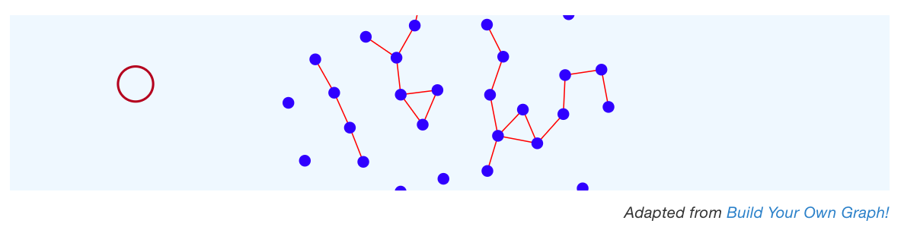
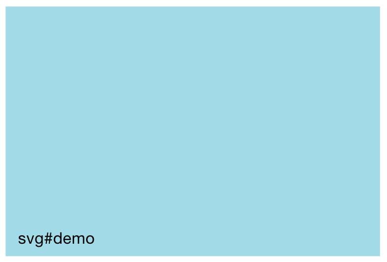

--- 
title: "D3 for R Users"
author: "Joyce Robbins"
date: "`r Sys.Date()`"
site: bookdown::bookdown_site
always_allow_html: yes
---

# Welcome to D3 {-}

```{r include=FALSE}
# automatically create a bib database for R packages
#knitr::write_bib(c(
#  .packages(), 'bookdown', 'knitr', 'rmarkdown'
#), 'packages.bib')

htmltools::tagList(rmarkdown::html_dependency_font_awesome())
#klippy::klippy(c("js", "r"))
```

<style>
rect {
	pointer-events: all;
	}

	.node {
	fill: blue;
	}

	.cursor {
	fill: none;
	stroke: brown;
	pointer-events: none;
	}

	.link {
	stroke: red;
}

.svg-container {
	display: inline-block;
	position: relative;
	width: 100%;
	padding-bottom: 20%;  <!-- changed this to be the same as y/x aspect ratio, not explained-->
	vertical-align: top;
	overflow: hidden;
}
.svg-content {
	display: inline-block;
	position: absolute;
	top: 0;
	left: 0;
}
</style>

<div id="container" class="svg-container">
<script src="https://d3js.org/d3.v3.min.js"></script>
<script src="scripts/index1.js"></script>
</div>


```{r, eval=!HTML, echo=FALSE}

```

```{asis, echo=HTML}
<div style="text-align: right; font-size: 85%; font-style: italic;"> <!-- text-align needs to be in parent -->
Adapted from <a href="https://bl.ocks.org/mbostock/929623" target="_blank">Build Your Own Graph!</a>
</div>
```


This guide serves as a companion text to Scott Murray’s [*Interactive Data Visualization for the Web, 2nd edition*](https://www.amazon.com/Interactive-Data-Visualization-Web-Introduction/dp/1491921285/)--henceforth *IDVW2*--a required text for GR5702. Be sure to get the second edition, which is a comprehensive update to D3 version 4. The first edition uses D3 version 3, which is not compatible. (The current version of D3 is actually v7.  However, since differences between v4 and v5/v6/v7 are minimal, unless otherwise indicated in this guide, the code in *IDVW2* will work with either.)

We rely on the text heavily but also deviate from it in several ways. *IDVW2* is written for graphics designers not data science students so the pain points are somewhat different. 

D3 is a JavaScript library, not a standalone language, so any time we refer to D3 we really mean D3/JavaScript, though it is not necessary to know JavaScript well before beginning; we will learn as we go. Most of the JavaScript we use is covered in *IDVW2*, though we also use some newer JavaScript options from ES5 and ES6, such as `.map()`, `.filter()`, arrow functions and template literals, that make coding easier (and more like R!)^[Ok, they're not actually that new, but it takes a while for new JavaScript to catch on, mainly due to concern with maintaining compatibility with older browsers. Since D3 itself is not compatible with very old browsers, and since we can't focus on everything at once, we are not going to concern ourselves with browser compatibility. If you are interested in this, [caniuse.com](https://caniuse.com){target="_blank"} is very helpful for looking up what works where.] We use different examples, though you are strongly encouraged to study [Murray's code examples ](https://github.com/alignedleft/d3-book/releases){target="_blank"} in addition to reading the text. Particularly through the first half, we don't follow the text in order, so always refer to this guide first which will direct you to the pages of the text that you should read.

This is very much a work-in-progress so please [submit issues](https://github.com/jtr13/d3book/issues){target="_blank"} on GitHub to provide feedback and edit or add text by submitting pull requests. (Click the <i class="fas fa-edit"></i> icon at the top of each page to get started. More [detailed instructions](https://edav.info/contribute.html#step-2-click-the-edit-button){target="_blank"} are available on edav.info. If you would just like to view the source code, click the <i class="fa fa-eye"></i> icon.)

## Workflow

A big hurdle to learning a new language is just getting setup. Often authors forget to mention what your programming environment should look like, what should be open on the screen. I will try not to do that and be as clear as possible so you know where you should be entering the code in the pages that follow. This task is somewhat complicated by the fact that we will be using a variety of workflow options.  This section will serve as a reference guide; future sections will link back here as appropriate.

All of our workflows require Google Chrome, so if you don't have it already, [download and install it](https://www.google.com/chrome/){target="_blank"}.


### JavaScript Console

With this workflow we will open a web page--either online or local--in Chrome and [run JavaScript in the Console](https://developers.google.com/web/tools/chrome-devtools/console/javascript){target="_blank"}. To view the Console, open Chrome DevTools by clicking *View, Developer, JavaScript Console* if you have a menu bar in Chrome, using a keyboard shortcut (Mac: option+command+j; Windows, Linux, Chrome OS: control+shift+J), or employing another one of the [many options](https://developers.google.com/web/tools/chrome-devtools/open){target="_blank"} for doing so. The Console is one piece of a suite of tools available in the browser.

With the DevTools open, your screen will look like this:

```{r, echo=FALSE}
knitr::include_graphics("images/console.png")
```


The next chapter, [Jump in the deep end](jump.html), employs this workflow.

### This book in the Console

If you're not reading the `.pdf` version, you can open DevTools on this very page. This is very convenient because not only to you not have to leave this book to practice D3, you can copy code blocks and paste them in the Console.  In addition to opening DevTools (see above), close the side bar by clicking on the <i class="fa fa-align-justify"></i> ("Toggle Sidebar") icon on the top left of the page, to the left of the search icon, to give yourself more screen space.

Let's try it out. 

> <i class="fa fa-hand-o-right"></i> *Open the JavaScript Console* <i class="fa fa-terminal"></i>

```{r, echo=FALSE, results='asis', eval=HTML}
makesvg("demo")
```

```{r, echo=FALSE, eval=!HTML, out.width='33%'}

```


Scroll so that both the blue rectangle above and the code chunk below are visible on your screen. Toggle the sidebar, open the Console, and then move the mouse onto the code block so the <i class="fa fa-copy"></i> icon appears. Click on it to copy the code, paste it in the Console, and then press return.

``` js
d3.select("svg#demo")
  .append("circle")
    .attr("cx", "-25")              
    .attr("cy", "100")
    .attr("r", "20")
    .attr("fill", "red")
  .transition()
  .duration(3000)
    .attr("cx", "325")
  .remove();
```    

Pretty neat.

### Text editor

This is a very basic local setup in which the same `.html` is open both in a text editor (if you don't want to stray too far from home, use RStudio) and in a web browser (we will use Chrome), each on one half of your screen. The workflow is: make changes to the file in the text editor, save the changes and then refresh the page in the browser to see the updates. Keyboard shortcuts for saving and refreshing (on the Mac, command-s and command-r respectively) are very helpful.  

Let's try an example:

Download a copy of `shapes.html` by opening [this page](https://raw.githubusercontent.com/jtr13/d3book/main/code/shapes.html){target="_blank"} and clicking *File, Save Page As...* Open the file in a text editor of your choice on one half of your screen. On the other half of your screen open the same file in Chrome. As you make changes to the `.html` file, save the file and then refresh the browser to see the effects. 

Your screen should look like this:

```{r, out.width='80%', fig.align='center', echo=FALSE}
knitr::include_graphics("images/editor_chrome.png")
```


