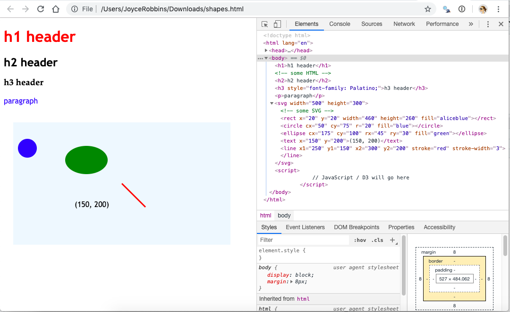

# Jump in the deep end <i class="fas fa-swimmer"></i> {#jump} 


Let's skip the explanations and start coding in D3 right now. Why? So you can see the benefits and know what you're working toward when you get stuck in the weeds.  Then we'll go back and start learning step by step. In this chapter we will work in the JavaScript Console ([help](index.html#javascript-console)).


## Get ready <i class="fas fa-forward"></i>

1. If you don't have it, [install the Chrome browser](https://www.google.com/chrome/){target="_blank"}.

2. Download a copy of `shapes.html` by opening [this file](https://raw.githubusercontent.com/jtr13/d3book/master/code/shapes.html){target="_blank"} and choosing File, Save Page As...

3. If Chrome is your default browser, open `shapes.html` by double clicking it. Otherwise, open Chrome first, click *File, Open File...*, and then choose `shapes.html` from the directory where you saved it.

## Elements tab <i class="far fa-folder"></i>

1. Open Chrome DevTools ([help](index.html#javascript-console)).

2. Hover the mouse over various elements in the `<body> ... </body>` section.  Observe the highlighted sections in the rendered web page on the left of the screen. Click on the mini black triangles to the left of the `<body>` and `<svg>` tags if needed to open these sections of the DOM tree. Your screen should look like this:

```{r, echo=FALSE, fig.align='center', out.width="80%"}

```

3. Now try the reverse: right click on elements on the web page, choose "Inspect" and see what is highlighted in the Elements pane. Get comfortable with the connection between the code on the right and the rendered elements on the left.

## Console tab <i class="far fa-folder"></i>

1. Switch to the Console tab, next to the Elements tab. Let's practice running some code. Note that the code is unrelated to the `shapes.html` web page that we have open. 
    
> <i class="far fa-lightbulb"></i> *We will spend a lot of time in the Console since it's interactive -- think R console. Eventually we will switch to including JavaScript/D3 in `.html` or `.js` files and use the Console only for testing things out or debugging.* 


2. Type the following lines of code at the prompt (`>`), press enter after each line--that is, after the semicolon (`;`)--and see what happens:

``` javascript
3 + 4;
    
"3" + "4";

 x = [1, 2, 3];
    
x[1];
    
x + 1;
    
y = {a: 3, b: 4};
    
y["b"];
```

## Modify elements <i class="fas fa-exchange-alt"></i>

1.  Now we'll start using D3 to manipulate elements on the page. Try the following, by entering one line at a time in the Console as before:

    ``` javascript
    d3.select("circle").attr("cx", "200");

    d3.select("circle").attr("cx", "500");

    d3.select("circle").attr("cx", "100");

    d3.select("circle").attr("r", "30");

    d3.select("circle").attr("r", "130");

    d3.select("circle").attr("r", "3");

    d3.select("circle").attr("fill", "red");

    d3.select("circle").attr("fill", "aliceblue");

    d3.select("circle").attr("fill", "lightseagreen");
    ```
    
    
> <i class="far fa-lightbulb"></i> *Note that "select" and "attr" are separate operations chained together with "." -- think pipe (%>%) operator.*

    

2.  Refresh the page. What happened?

3.  Go to Elements. Look at the value of the `y1` attribute of the SVG `<line>` element. Go back to the Console and enter the following:

    ``` javascript
    d3.select("line").attr("y1", "10");
    ```

4.  Switch back to Elements and observe. What happened?

5.  Stay in Elements and refresh the page. What happened to `y1`?

6. Return to the Console to make style changes to the HTML elements:

    ``` javascript
    d3.select("h1").style("color", "purple");

    d3.select("h2").style("font-size", "50px");

    d3.select("h2").style("font-family", "Impact");
    ```

## Add transitions <i class="far fa-paper-plane"></i>

1.  Try these:

    ``` javascript
    d3.select("circle").transition().duration(2000).attr("cx", "400");

    d3.select("ellipse").transition().duration(2000).attr("transform", "translate (400, 400)");

    d3.select("line").transition().duration(2000).attr("x1", "400");

    d3.select("line").transition().duration(2000).attr("y1", "250");

    d3.select("p").transition().duration(2000).style("font-size", "72px");
    ```

2.  Experiment with more transitions.

## Add interactivity <i class="fas fa-mouse-pointer"></i> 


1.  Set up a function to turn the fill color to yellow:

    ``` javascript
    function goyellow() {d3.select(this).attr("fill", "yellow")};
    ```

2.  Add an event listener to the circle that will be trigger a call to `goyellow()` on a mouseover:

    ``` javascript
    d3.select("circle").on("mouseover", goyellow);
    ```

3.  Test it out.

4.  Add the same event listener to the ellipse. Test it out.

5.  Create a function `goblue()` that changes the fill color to blue.

6.  Add event listeners to the circle and ellipse that will trigger a call to `goblue()` on a *mouseout*. Test out your code.

7.  Try out a click event. (Note the use of an anonymous function.)

    ``` javascript
    d3.select("line").on("click", function()
      {d3.select(this).attr("stroke-width", "10");});
    ```

8.  Try another click event. What's happening?

    ``` javascript
    d3.select("svg").on("click", function(event)
      {d3.select("text").text(`(${d3.pointer(event)})`)});
    ```
