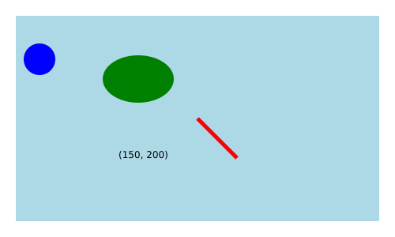

# Web tech <i class="fas fa-server"></i> {#web}

Read *IDVW2*, Chapter 3: Technology Fundamentals

*There is a lot of material in this chapter. It is worth making the effort to learn it now and start D3 with a solid foundation of elementary HTML/CSS/SVG/JavaScript.*

Here we examine `shapes.html` from Chapter 1 to see how the various technologies are combined into a single document.

## HTML <i class="fab fa-html5"></i>

Note that `shapes.html` has an HyperText Markup Language or `.html` extension; HTML in fact provides the structure for the document.  It has a `<head>` and `<body>` section. 

In the `<head>` section we use `<script>` tags to link to the D3 library:

``` js
<script src="https://d3js.org/d3.v7.js"></script>
```

HTML content is enclosed between opening an closing **tags** such as `<h1>` and `</h1>`.

HTML class and ID **attributes** are included inside the opening tags:

`<h1 class="myclass" id="myid">This is an h1 header.</h1>`


## CSS <i class="fab fa-css3"></i>

CSS (Cascading Style Sheets) is used for styling web pages, and more importantly for our purposes, selecting elements on a page or in a graphic. We will generally work with internal style sheets since it's simpler when starting out to have everything in one document.  External style sheets, however, are generally the preferred method for web design.

### Internal style sheet

`shapes.html` has an *internal style sheet*: CSS style information appears in the `<head>` section marked off with `<style>` tags:

``` js
<style type="text/css">
    h1 {color:red;}		/* CSS styling */
    p {color:blue;}
</style>
```

Here we specify that all HTML `<h1>` headers should be red and all HTML paragraphs `<p>` should be blue.  This is an example of an *internal style sheet*. Later we will consider alternatives: *external style sheets* and *inline styling*. 

Styling for coder designed classes is also specified in this section.  For example, we could style a "formal" class as such:

``` js
<style type="text/css">
    .formal {color: red;        
        font-size: 30px;
        font-family: Lucida Calligraphy;
        }   
</style>
```

Note that classes are defined by the "." before the name.


### External style sheets

External style sheets are `.css` files that contain styling information and are linked to with a `<link>` tag in the `<head>` section of an HTML document:

``` js
<head>
    <link rel="stylesheet" href="style.css">
</head>
```

External style sheets are the preferred way of styling as they can easily be modified without changing the web page; in fact, the motivation for CSS came from a desire in the early days of the internet to separate styling from content.


Developers have the option now of choosing premade themes, which are shared through external style sheets. They can be quite complex. The [`.css` file](https://github.com/thomaspark/bootswatch/blob/master/docs/4/minty/bootstrap.css){target="_blank"} for the <a href="https://bootswatch.com/minty/" target="_blank" style = "font-family: Roboto; background-color: #78C2AD; color: white; border-radius: 5px">&nbsp;Minty&nbsp;</a> theme from Bootswatch, for example, contains over 10,000 lines.

[CSS Zen Garden](http://www.csszengarden.com/){target="_blank"} demonstrates the power of external style sheets: the same HTML document takes on very different looks depending on the stylesheet to which it is linked.


### Inline styling

With inline styling, styling is added to each tag individually:

```
<span style="color: white; background-color: fuchsia; font-family: impact; 
      font-size: 24px; border-style: solid; border-color: limegreen; 
      border-width: 3px">
      Styled inline
</span>
```

```{asis, eval=knitr::is_html_output()}
<span style="color: white; background-color: fuchsia; font-family: impact; font-size: 24px; border-style: solid; border-color: limegreen; border-width: 3px">Styled inline</span>
```


This is how early web pages were styled. To take a step back in time, use developer tools to view the source code for the main page of [www.dolekemp96.org](http://www.dolekemp96.org/main.htm){target="_blank"}, an old web site that has been maintained for historical purposes. As you can see, it's a tedious way of writing content, which internal and external style sheets eliminate.

Although you will not be adding inline styling manually, you will notice that when we select elements and change the styling with D3, the modifications are made inline.  In other words, we do not make changes to the elements directly, not via a style sheet.


## SVG <i class="far fa-image"></i>

SVG (Scalable Vector Graphics) is a human readable graphics format that facilitates manipulation of individual elements. You may be familiar with `.svg` files.  Here we have SVG graphics within `<svg>` tags in the `<body>` section of the HTML document:


``` js
<svg width="500" height="300">  <!-- some SVG -->
    <rect x="20" y="20" width="460" height="260" fill="lightblue"></rect>
    <circle cx="50" cy="75" r="20" fill="blue"></circle>
    <ellipse cx="175" cy="100" rx="45" ry="30" fill="green"></ellipse>
    <text x="150" y="200">(150, 200)</text>
    <line x1="250" y1="150" x2="300" y2="200" stroke="red" stroke-width="5"></line>
</svg>
```

<script src="https://d3js.org/d3.v7.min.js"></script>

```{r, eval=knitr::is_latex_output(), out.width="50%", echo=FALSE}

```

```{asis, eval=knitr::is_html_output()}
<svg width="500" height="300">  <!-- some SVG -->
<rect x="20" y="20" width="460" height="260" fill="lightblue"></rect>
<circle cx="50" cy="75" r="20" fill="blue"></circle>
<ellipse cx="175" cy="100" rx="45" ry="30" fill="green"></ellipse>
<text x="150" y="200">(150, 200)</text>
<line x1="250" y1="150" x2="300" y2="200" stroke="red" stroke-width="5"></line>
</svg>
```

There are very few SVG tags that you'll need to know, and once we get going with D3, you will not have to code any SVG manually. It is worth doing a little to become familiar with the format and in particular to get used to the new location of the origin.

## JavaScript <i class="fab fa-js-square"></i>

JavaScript is the most common language for making web pages interactive. Code is executed when pages are opened or refreshed. So far we have run JavaScript in the Console, but have not included it in the web page itself. When we do so, it will be between `<script>` tags in the `<body>` section of the HTML document, or in a separate `.js` file.

We will learn JavaScript on an as-needed basis. In terms of data, we will begin with simple arrays:

`const x = [3, 5, 1, 6, 7]`

In the [Just Enough JS](just-enough-js.html) chapter, we cover more complex data structures and some methods for data manipulation. 

[javascript.info](https://javascript.info){target="_blank"} is an excellent resource for expanding your knowledge beyond the basics.

## D3 <i class="far fa-chart-bar"></i>

D3 (Data Driven Documents) is a JavaScript library well suited to interactive graphics. As such, it is also included between `<script>` tags in the `<body>` section. For D3 to work, you must link to the D3 library in the `<head>` section of the document.

There seems to be a misconception that D3 is a high level language.  It is not. You will be working on the pixel level to create graphics, including drawing your own axes and doing other things that you're not used to doing if you've been working in R or Python.

> <i class="far fa-lightbulb"></i> *On the bright side, after D3, you will gain a new appreciation for base R graphics. You will write code such as `plot(iris$Sepal.Length, iris$Sepal.Width, pch = 16, col = iris$Species, las = 1, xlab = "Sepal.Length", ylab = "Sepal.Width")` and think: wow, there are axes! Amazing!*

It is legitimate to ask why you need to know D3 as a data scientist. Many if not most of you will not be coding in JavaScript from the ground up in your future careers. However, it's a great way to learn how interactive graphics work under the hood, and will give you a solid foundation which you can draw on to tweak visualizations that you build with high level tools such as [Plotly](https://plot.ly/). 

## HTML tree <i class="fas fa-tree"></i>

While `shapes.html` appears as a single consistent document, it is actually comprised of multiple languages. HTML, CSS, and SVG are already there, and we will be adding JavaScript / D3 soon. 

```{r, echo=FALSE, fig.align='center', out.width='100%'}
knitr::include_graphics("images/shapes.png")
```

Of note:

- An HTML document is composed of lines or sections set off with tags. In particular `<style> ... </style>`, `<svg> ... </svg>`, and `<script> ... </script>` indicate the inclusion of CSS, SVG, and JavaScript/D3 respectively.

- For D3 to work, you must link to a D3 library. To link to the online version, include this line: `<script src="https://cdn.jsdelivr.net/npm/d3@7"></script>` or `<script src="https://d3js.org/d3.v7.js"></script>`. Alternatively, you can download a copy of the library from [https://d3js.org/getting-started#d3-in-vanilla-html](https://d3js.org/getting-started#d3-in-vanilla-html)--clicking on `d3.v7.js` or `d3.v7.min.js` will download the file. Then add the following to the `<head>` section of your `.html` file:

    ``` js
    <script src="d3.js"></script>
    ```
    
- There are two main sections. The `<head>` section contains the *title*, *link to D3 library*, and *internal CSS*. The `<body>` section contains HTML elements (`<h1>`, `<p>`, etc.), SVGs (between `<svg>`/`</svg>`tags) and JavaScript/D3 scripts (between `<script>`/`<script>`tags).

> <i class="far fa-lightbulb"></i> *Do not assume that if it works that it is correct; today's browsers can be very forgiving.*

- Comment syntax varies with language:

    - `<!-- single or multiline HTML or SVG comment -->`
    
    - `/* single or multiline CSS comment */`
    
    - `// single line JavaScript comment`
    
    - `/* JavaScript` <br> `multiline comment */`
    
## Exercise <i class="fas fa-dumbbell"></i>: shapes

Download a copy of `shapes.html` by opening [this page](https://raw.githubusercontent.com/jtr13/d3book/main/code/shapes.html){target="_blank"} and clicking *File, Save Page As...* Set yourself up to work locally in a text editor [help](index.html#text-editor). (Developer Tools should not be open; we will not be using the Console.)

1. Add an additional circle to the svg.

2. Add styling to the internal style sheet to style circles.

3. Add two additional paragraphs using the `<p>` tag.

4. Add an ID attribute to one of the circles.

5. Add a class attribute to two of the `<p>` tags.

6. Use the internal style sheet to style paragraphs of the class you created in 5.

7. Adjust additional elements as desired.

[Solution](solutions/webtech_shapes.html){target="_blank"}
*Contributed by Tracy Liu*
